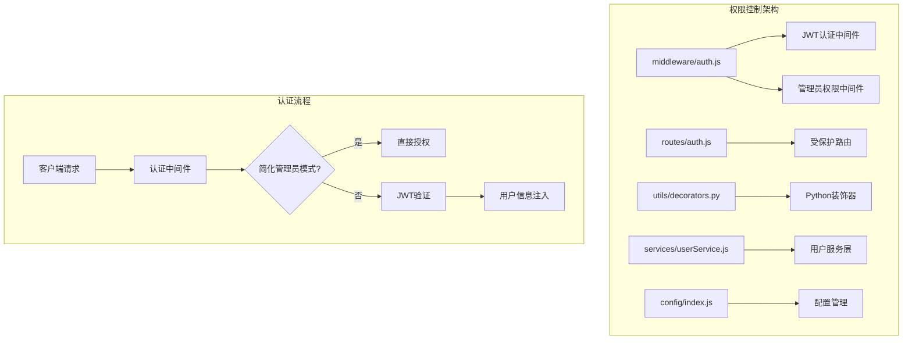
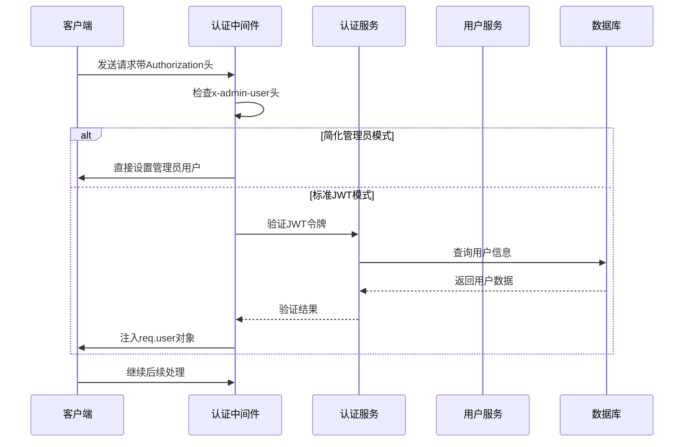
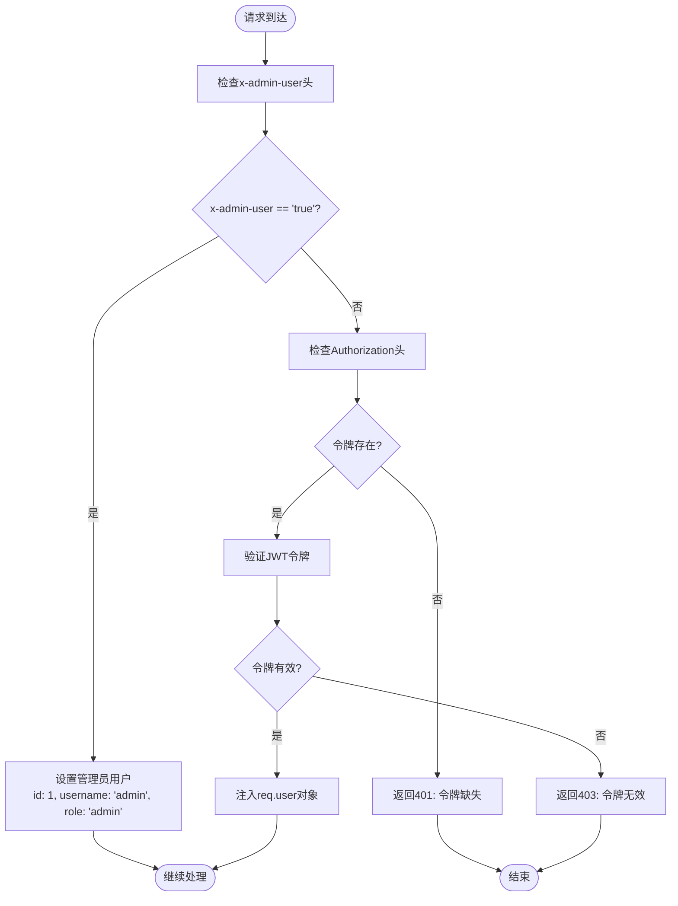
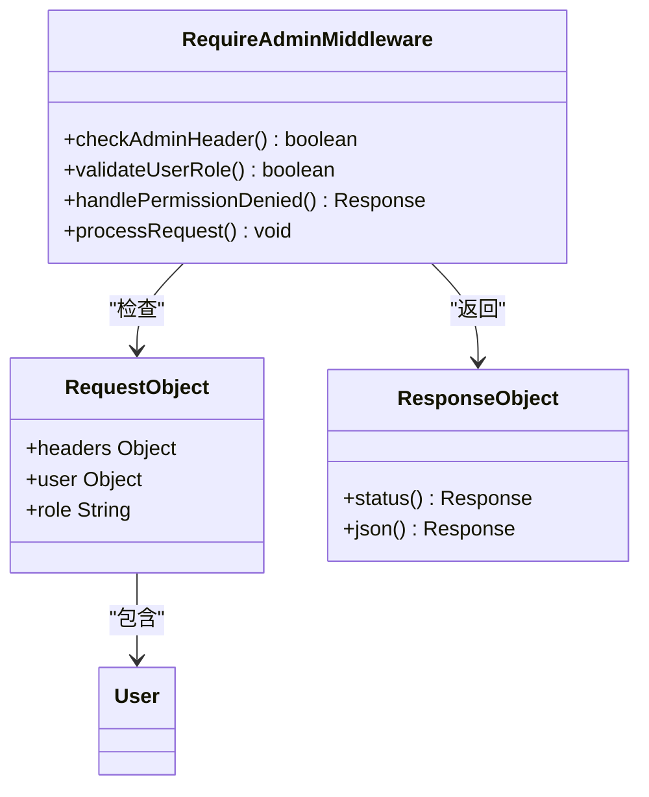
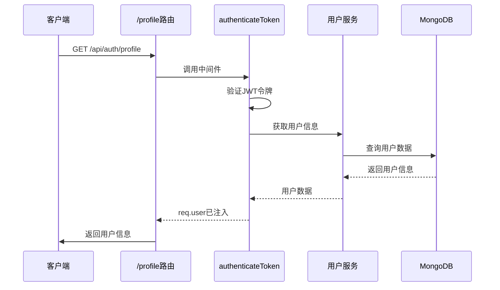
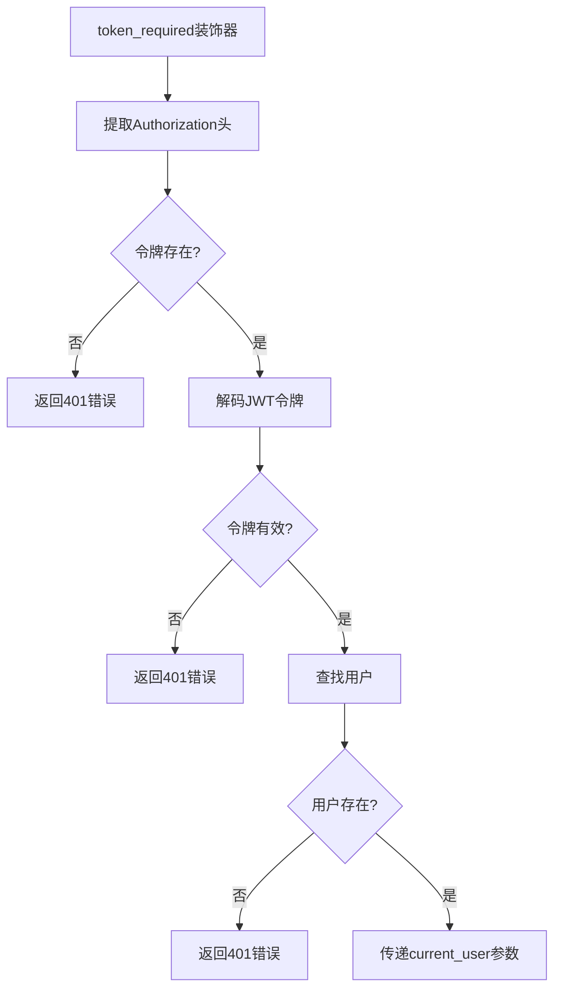
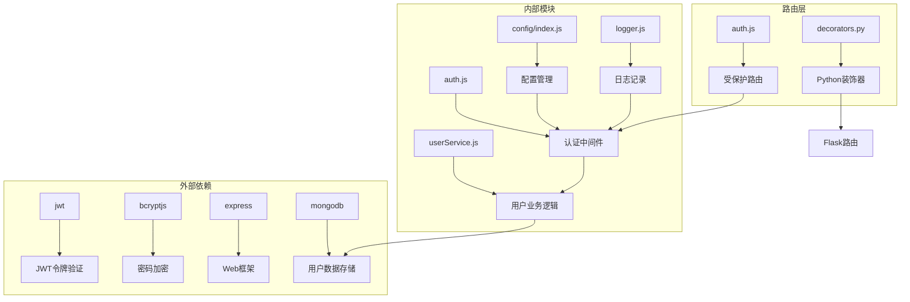

# 权限控制

<cite>
**本文档中引用的文件**
- [backend/src/middleware/auth.js](file://backend/src/middleware/auth.js)
- [backend/src/routes/auth.js](file://backend/src/routes/auth.js)
- [backend/routes/auth.py](file://backend/routes/auth.py)
- [backend/utils/decorators.py](file://backend/utils/decorators.py)
- [backend/src/services/userService.js](file://backend/src/services/userService.js)
- [backend/src/config/index.js](file://backend/src/config/index.js)
- [backend/src/app.js](file://backend/src/app.js)
</cite>

## 目录
1. [简介](#简介)
2. [项目结构](#项目结构)
3. [核心组件](#核心组件)
4. [架构概览](#架构概览)
5. [详细组件分析](#详细组件分析)
6. [依赖关系分析](#依赖关系分析)
7. [性能考虑](#性能考虑)
8. [故障排除指南](#故障排除指南)
9. [结论](#结论)

## 简介

本文档深入解析基于JWT（JSON Web Token）的权限控制系统，该系统采用多层次的安全架构，支持管理员简化模式和标准JWT认证两种方式。系统设计遵循最小权限原则，通过角色基础的访问控制（RBAC）确保不同用户类型的适当权限隔离。

## 项目结构

权限控制系统的核心文件分布在以下目录结构中：

**图表来源**
- [backend/src/middleware/auth.js](file://backend/src/middleware/auth.js#L1-L106)
- [backend/src/routes/auth.js](file://backend/src/routes/auth.js#L1-L144)

**章节来源**
- [backend/src/middleware/auth.js](file://backend/src/middleware/auth.js#L1-L106)
- [backend/src/routes/auth.js](file://backend/src/routes/auth.js#L1-L144)

## 核心组件

### JWT认证中间件

JWT认证中间件是整个权限控制系统的核心，负责验证请求中的JWT令牌并注入用户信息。

主要功能：
- 支持简化管理员模式和标准JWT认证
- 自动解析Authorization头部的Bearer令牌
- 验证令牌签名和过期时间
- 将用户信息注入到请求对象

### 管理员权限中间件

专门用于验证管理员权限的中间件，支持简化管理员模式下的特殊处理。

### 用户服务层

提供用户相关的业务逻辑，包括注册、登录、密码修改等功能，同时维护用户角色信息。

**章节来源**
- [backend/src/middleware/auth.js](file://backend/src/middleware/auth.js#L5-L48)
- [backend/src/services/userService.js](file://backend/src/services/userService.js#L1-L318)

## 架构概览

权限控制系统采用分层架构设计，确保安全性和可扩展性：

**图表来源**
- [backend/src/middleware/auth.js](file://backend/src/middleware/auth.js#L5-L48)
- [backend/src/services/userService.js](file://backend/src/services/userService.js#L92-L196)

## 详细组件分析

### authenticateToken中间件详细分析

authenticateToken中间件实现了双重认证机制：

#### 简化管理员模式
当请求包含`x-admin-user: true`头部时，系统自动授予管理员权限，无需JWT验证。这种设计主要用于开发测试和特殊管理场景。

**图表来源**
- [backend/src/middleware/auth.js](file://backend/src/middleware/auth.js#L5-L48)

#### 标准JWT认证流程
1. **令牌提取**：从Authorization头部提取Bearer令牌
2. **令牌验证**：使用JWT密钥验证令牌签名和过期时间
3. **用户信息注入**：将解码后的用户信息存储到`req.user`对象

### requireAdmin中间件分析

requireAdmin中间件专门用于管理员权限验证：

**图表来源**
- [backend/src/middleware/auth.js](file://backend/src/middleware/auth.js#L65-L82)

### 用户角色系统

系统采用基于角色的访问控制（RBAC），主要角色类型：

| 角色 | 权限级别 | 描述 | 示例 |
|------|----------|------|------|
| user | 普通用户 | 基本功能访问权限 | 查看武器信息、修改个人资料 |
| admin | 管理员 | 所有功能访问权限 | 添加/删除武器、管理用户 |
| 简化管理员 | 特殊权限 | 测试环境专用权限 | 无需JWT验证的管理员操作 |

**章节来源**
- [backend/src/services/userService.js](file://backend/src/services/userService.js#L35-L45)
- [backend/src/middleware/auth.js](file://backend/src/middleware/auth.js#L65-L82)

### 受保护路由示例

#### /profile 路由
展示标准JWT认证的应用：

**图表来源**
- [backend/src/routes/auth.js](file://backend/src/routes/auth.js#L35-L45)
- [backend/src/services/userService.js](file://backend/src/services/userService.js#L165-L196)

#### /change-password 路由
展示密码修改的权限验证：

该路由要求用户提供有效的JWT令牌，并且只能修改自己的密码。系统会验证：
- 当前密码正确性
- 新密码长度要求
- 用户身份验证

**章节来源**
- [backend/src/routes/auth.js](file://backend/src/routes/auth.js#L65-L95)

### Python装饰器分析

对于Flask后端，系统使用Python装饰器实现类似的权限控制：

**图表来源**
- [backend/utils/decorators.py](file://backend/utils/decorators.py#L7-L50)

**章节来源**
- [backend/utils/decorators.py](file://backend/utils/decorators.py#L1-L51)
- [backend/routes/auth.py](file://backend/routes/auth.py#L85-L99)

## 依赖关系分析

权限控制系统的依赖关系图展示了各组件之间的相互依赖：

**图表来源**
- [backend/src/middleware/auth.js](file://backend/src/middleware/auth.js#L1-L3)
- [backend/src/services/userService.js](file://backend/src/services/userService.js#L1-L5)

**章节来源**
- [backend/src/middleware/auth.js](file://backend/src/middleware/auth.js#L1-L106)
- [backend/src/services/userService.js](file://backend/src/services/userService.js#L1-L318)

## 性能考虑

### JWT令牌缓存策略
- **令牌验证缓存**：对于频繁访问的用户，可以考虑在内存中缓存验证结果
- **过期时间优化**：根据使用场景调整令牌过期时间，平衡安全性和用户体验
- **密钥轮换**：定期更换JWT密钥以提高安全性

### 数据库查询优化
- **索引优化**：在用户表的username和email字段上建立索引
- **查询优化**：避免不必要的字段查询，使用投影减少数据传输
- **连接池管理**：合理配置数据库连接池大小

### 中间件性能
- **早期退出**：在认证失败时尽早返回，避免不必要的处理
- **日志优化**：在生产环境中减少详细日志输出
- **并发处理**：确保中间件能够处理高并发请求

## 故障排除指南

### 常见认证问题

#### 401 Unauthorized - 令牌缺失
**原因**：请求中缺少Authorization头部或格式不正确
**解决方案**：
- 确保请求头格式为`Authorization: Bearer <token>`
- 检查客户端是否正确设置了认证头

#### 403 Forbidden - 令牌无效或已过期
**原因**：JWT令牌签名验证失败或已超过有效期
**解决方案**：
- 检查JWT密钥是否正确
- 验证令牌过期时间设置
- 确认服务器时间同步

#### 管理员权限问题
**原因**：简化管理员模式配置错误
**解决方案**：
- 检查`x-admin-user`头部设置
- 确认简化管理员模式的使用场景

### 调试技巧

1. **启用详细日志**：在开发环境中启用详细的认证日志
2. **令牌验证工具**：使用在线JWT解码工具验证令牌内容
3. **网络抓包**：使用浏览器开发者工具检查请求头设置

**章节来源**
- [backend/src/middleware/auth.js](file://backend/src/middleware/auth.js#L25-L48)
- [backend/src/app.js](file://backend/src/app.js#L150-L180)

## 结论

基于JWT的权限控制系统提供了强大而灵活的安全机制，通过以下特性确保系统的安全性：

### 主要优势
- **双重认证机制**：支持简化管理员模式和标准JWT认证
- **细粒度权限控制**：基于角色的访问控制（RBAC）
- **可扩展架构**：模块化设计便于功能扩展
- **跨平台兼容**：支持JavaScript和Python双后端

### 安全特性
- **令牌签名验证**：防止令牌篡改
- **过期时间控制**：自动失效机制
- **权限隔离**：不同角色的权限严格分离
- **审计日志**：完整的操作记录

### 扩展建议
1. **细粒度权限控制**：添加基于资源的访问控制（ABAC）
2. **多因素认证**：集成短信验证码或生物识别
3. **令牌黑名单**：实现已注销令牌的即时失效
4. **权限缓存**：优化频繁权限检查的性能

该权限控制系统为兵智世界项目提供了坚实的安全基础，支持从普通用户到管理员的各种访问需求，同时保持了良好的可维护性和扩展性。