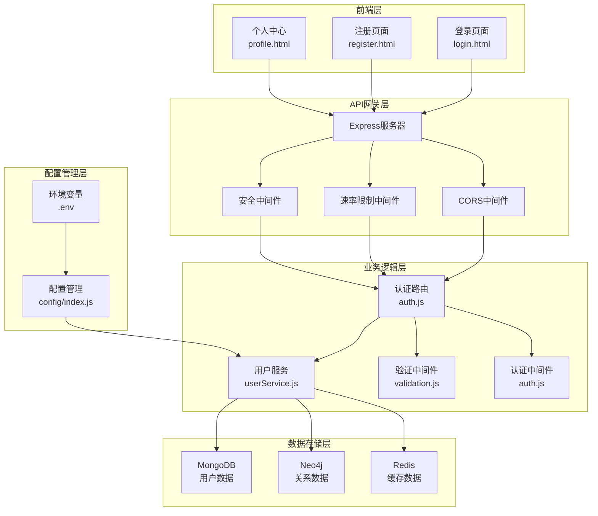
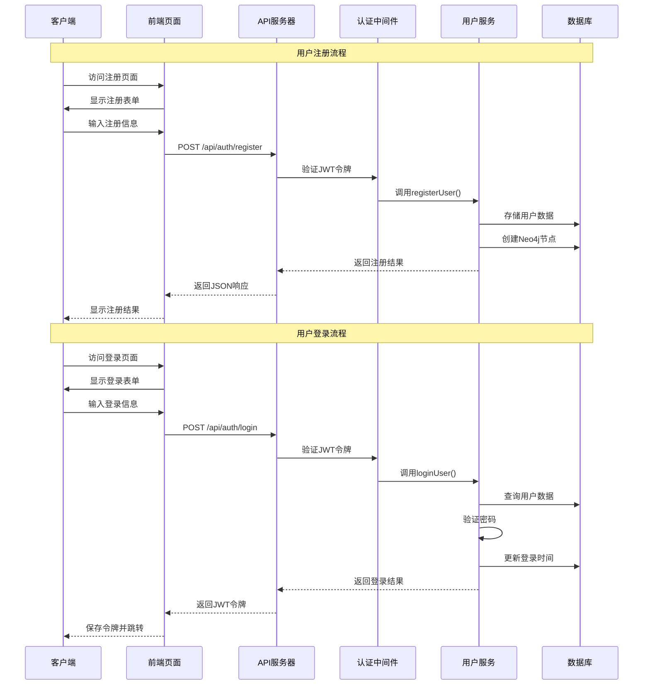
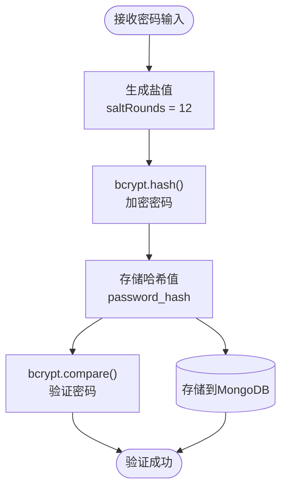
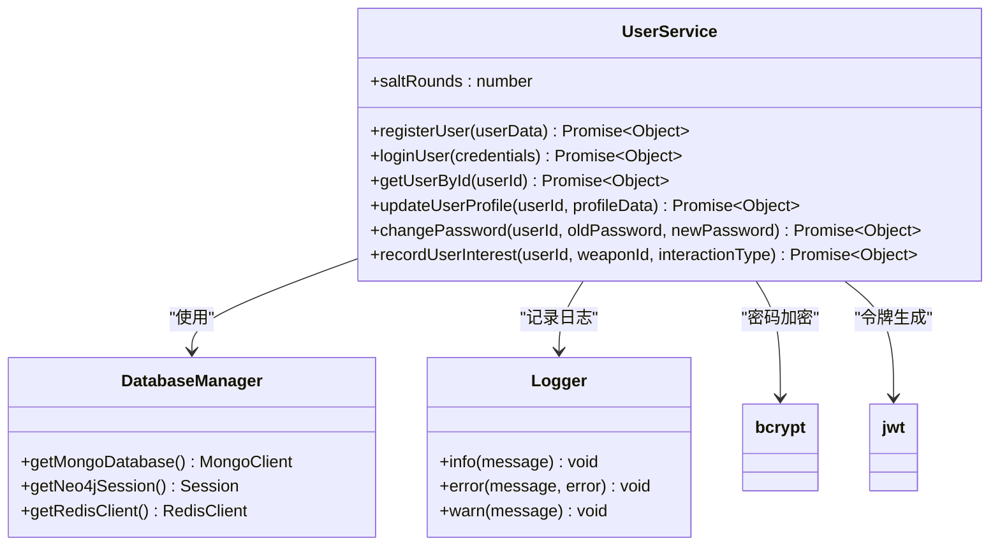
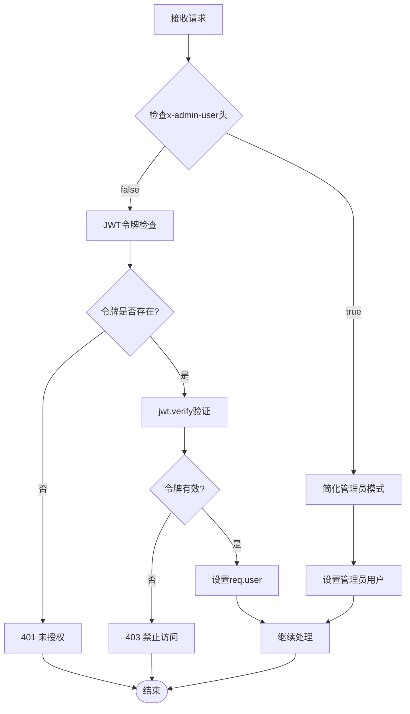
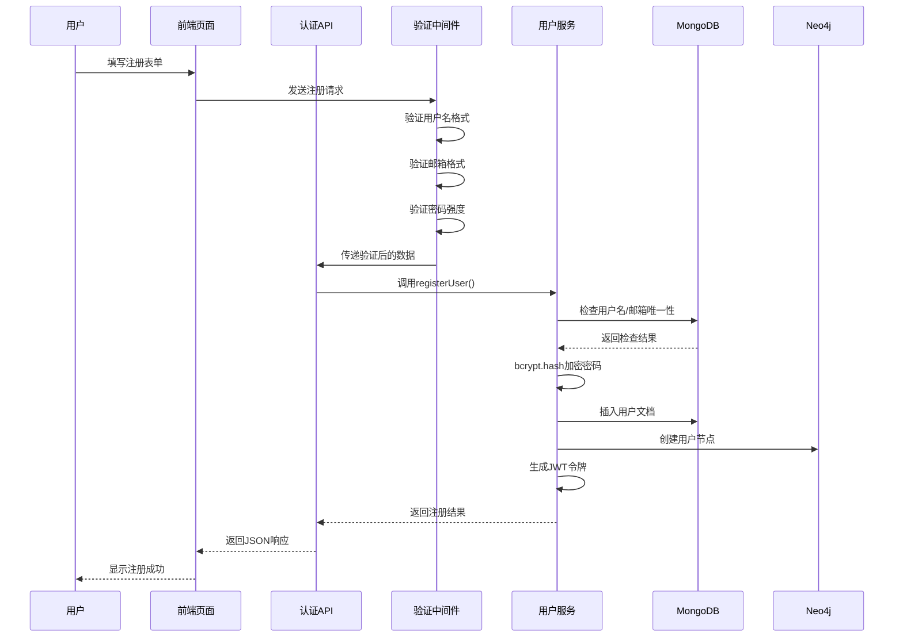
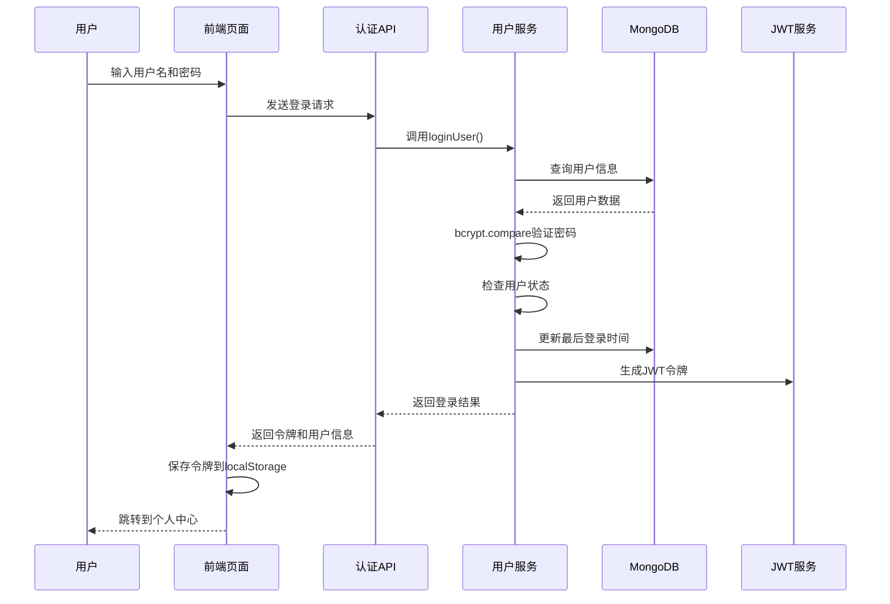
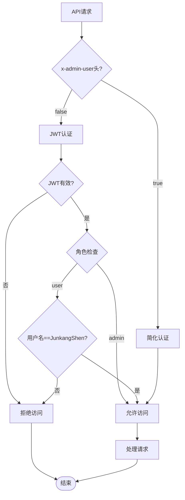
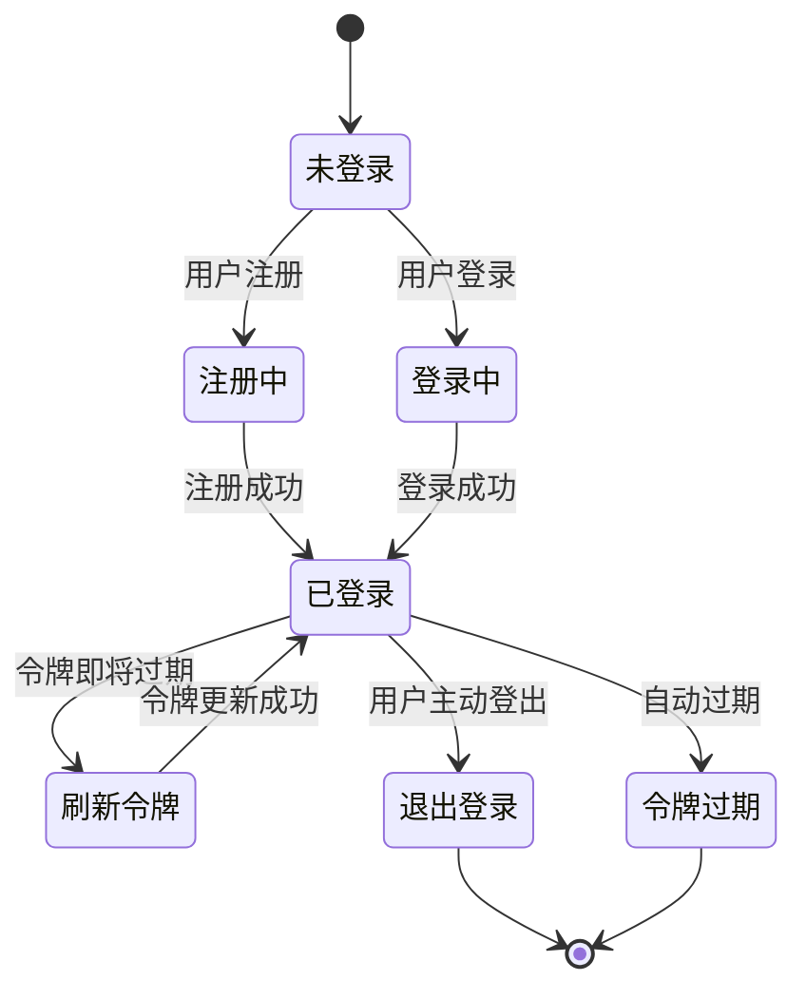

# 用户系统

<cite>
**本文档中引用的文件**
- [backend/src/routes/auth.js](file://backend/src/routes/auth.js)
- [backend/src/services/userService.js](file://backend/src/services/userService.js)
- [backend/src/middleware/auth.js](file://backend/src/middleware/auth.js)
- [backend/src/middleware/validation.js](file://backend/src/middleware/validation.js)
- [backend/src/config/index.js](file://backend/src/config/index.js)
- [backend/src/config/database_Neo4j.js](file://backend/src/config/database_Neo4j.js)
- [login.html](file://login.html)
- [register.html](file://register.html)
- [profile.html](file://profile.html)
- [package.json](file://package.json)
</cite>

## 目录
1. [系统概述](#系统概述)
2. [架构设计](#架构设计)
3. [核心组件分析](#核心组件分析)
4. [认证流程详解](#认证流程详解)
5. [权限控制系统](#权限控制系统)
6. [安全防护机制](#安全防护机制)
7. [用户会话管理](#用户会话管理)
8. [最佳实践指南](#最佳实践指南)
9. [故障排除](#故障排除)
10. [总结](#总结)

## 系统概述

兵智世界用户系统是一个基于现代Web技术构建的完整用户认证和授权解决方案，采用前后端分离架构，支持用户注册、登录认证、权限控制和个人资料管理等核心功能。系统具有以下特点：

- **多数据库支持**：同时使用MongoDB、Neo4j和Redis作为数据存储
- **JWT认证**：基于JSON Web Token的无状态认证机制
- **分级权限**：区分普通用户和管理员权限
- **安全防护**：集成多种安全措施防止恶意攻击
- **简化模式**：支持开发环境下的管理员简化模式

## 架构设计

### 系统架构图



**图表来源**
- [backend/src/routes/auth.js](file://backend/src/routes/auth.js#L1-L144)
- [backend/src/services/userService.js](file://backend/src/services/userService.js#L1-L318)
- [backend/src/middleware/auth.js](file://backend/src/middleware/auth.js#L1-L106)

### 数据流架构



**图表来源**
- [backend/src/routes/auth.js](file://backend/src/routes/auth.js#L8-L30)
- [backend/src/services/userService.js](file://backend/src/services/userService.js#L15-L85)

## 核心组件分析

### 认证路由模块 (auth.js)

认证路由模块负责处理所有与用户认证相关的HTTP请求，包括注册、登录、获取用户信息、更新资料等功能。

#### 主要功能接口

| 接口路径 | HTTP方法 | 功能描述 | 权限要求 |
|---------|---------|---------|---------|
| `/api/auth/register` | POST | 用户注册 | 无 |
| `/api/auth/login` | POST | 用户登录 | 无 |
| `/api/auth/profile` | GET | 获取用户信息 | 已认证 |
| `/api/auth/profile` | PUT | 更新用户资料 | 已认证 |
| `/api/auth/change-password` | PUT | 修改密码 | 已认证 |
| `/api/auth/refresh` | POST | 刷新令牌 | 已认证 |
| `/api/auth/logout` | POST | 退出登录 | 已认证 |

#### 密码加密机制

系统使用bcryptjs库对用户密码进行安全加密：



**图表来源**
- [backend/src/services/userService.js](file://backend/src/services/userService.js#L18-L25)
- [backend/src/services/userService.js](file://backend/src/services/userService.js#L237-L287)

**章节来源**
- [backend/src/routes/auth.js](file://backend/src/routes/auth.js#L1-L144)
- [backend/src/services/userService.js](file://backend/src/services/userService.js#L1-L318)

### 用户服务模块 (userService.js)

用户服务模块封装了所有用户相关的业务逻辑，包括数据验证、密码处理、数据库操作等。

#### 核心业务流程



**图表来源**
- [backend/src/services/userService.js](file://backend/src/services/userService.js#L6-L318)
- [backend/src/config/database_Neo4j.js](file://backend/src/config/database_Neo4j.js#L6-L141)

**章节来源**
- [backend/src/services/userService.js](file://backend/src/services/userService.js#L1-L318)

### 认证中间件 (auth.js)

认证中间件负责处理JWT令牌验证、权限检查和简化管理员模式。

#### 令牌验证流程



**图表来源**
- [backend/src/middleware/auth.js](file://backend/src/middleware/auth.js#L6-L48)

#### 管理员权限控制

系统实现了双重管理员验证机制：

1. **简化管理员模式**：通过`x-admin-user: true`头直接授予管理员权限
2. **标准管理员模式**：通过用户角色验证，用户名为`JunkangShen`的用户自动获得管理员权限

**章节来源**
- [backend/src/middleware/auth.js](file://backend/src/middleware/auth.js#L1-L106)

### 输入验证系统 (validation.js)

输入验证系统使用Joi库对用户输入进行严格验证，确保数据安全性和完整性。

#### 验证规则配置

| 验证规则 | 字段要求 | 错误提示 |
|---------|---------|---------|
| 用户名 | 字母数字组合，3-30字符 | "用户名只能包含字母和数字" |
| 邮箱 | 有效邮箱格式 | "请输入有效的邮箱地址" |
| 密码 | 至少6字符，最多128字符 | "密码至少需要6个字符" |
| 姓名 | 可选，2-50字符 | "姓名至少需要2个字符" |

**章节来源**
- [backend/src/middleware/validation.js](file://backend/src/middleware/validation.js#L1-L178)

## 认证流程详解

### 用户注册流程



**图表来源**
- [backend/src/routes/auth.js](file://backend/src/routes/auth.js#L8-L16)
- [backend/src/services/userService.js](file://backend/src/services/userService.js#L15-L85)

### 用户登录流程



**图表来源**
- [backend/src/routes/auth.js](file://backend/src/routes/auth.js#L18-L26)
- [backend/src/services/userService.js](file://backend/src/services/userService.js#L87-L160)

**章节来源**
- [login.html](file://login.html#L1-L120)
- [register.html](file://register.html#L1-L127)

## 权限控制系统

### 角色权限模型

系统采用基于角色的访问控制（RBAC）模型，支持两种角色：

| 角色 | 权限范围 | 特殊标识 |
|-----|---------|---------|
| user | 普通用户功能 | 默认角色 |
| admin | 管理员功能<br/>数据管理<br/>系统配置 | JunkangShen用户名 |

### 管理员特殊权限

系统为`JunkangShen`用户设置了特殊权限，包括：

1. **直接API访问**：无需JWT验证即可访问管理端点
2. **数据管理权限**：可以直接添加、修改、删除武器数据
3. **简化管理模式**：通过`x-admin-user`头启用简化权限验证



**图表来源**
- [backend/src/middleware/auth.js](file://backend/src/middleware/auth.js#L4-L48)

**章节来源**
- [backend/src/middleware/auth.js](file://backend/src/middleware/auth.js#L58-L75)

## 安全防护机制

### 多层次安全防护

#### 1. 密码安全

- **哈希加密**：使用bcryptjs进行密码哈希，salt轮数为12
- **密码强度验证**：最小6字符，最大128字符
- **明文传输保护**：仅在传输过程中保持明文，存储时为哈希值

#### 2. 令牌安全

- **JWT签名**：使用强密钥签名，支持自定义过期时间
- **令牌刷新**：提供令牌刷新机制，延长会话有效期
- **令牌撤销**：支持简单的令牌撤销（可扩展黑名单机制）

#### 3. 输入验证

- **Joi验证**：严格的输入数据验证
- **SQL注入防护**：使用参数化查询
- **XSS防护**：前端输出编码

#### 4. 网络安全

- **HTTPS强制**：生产环境启用HTTPS
- **CORS限制**：严格控制跨域请求
- **内容安全策略**：使用Helmet中间件增强安全性

### 速率限制机制

系统实现了基于IP的速率限制，防止暴力破解和DDoS攻击：

| 参数 | 默认值 | 说明 |
|-----|-------|------|
| 时间窗口 | 15分钟 | 900000毫秒 |
| 最大请求数 | 1000 | 15分钟内最多1000个请求 |
| 限制类型 | IP限制 | 基于客户端IP进行限制 |

**章节来源**
- [backend/src/config/index.js](file://backend/src/config/index.js#L35-L42)
- [backend/src/services/userService.js](file://backend/src/services/userService.js#L237-L287)

## 用户会话管理

### 会话生命周期



### 前端会话管理

前端使用localStorage存储用户会话信息：

```javascript
// 会话信息存储格式
{
  authToken: "jwt_token_string",
  userInfo: {
    id: "user_id",
    username: "username",
    email: "email@example.com",
    role: "user",
    isLoggedIn: true,
    loginTime: "timestamp"
  }
}
```

### 会话安全特性

1. **自动过期**：JWT令牌具有过期时间
2. **令牌刷新**：支持定期刷新令牌
3. **异地登录检测**：可通过扩展实现
4. **会话绑定**：可绑定设备信息

**章节来源**
- [login.html](file://login.html#L35-L45)
- [profile.html](file://profile.html#L40-L60)

## 最佳实践指南

### 开发环境配置

#### 环境变量配置

```bash
# JWT配置
JWT_SECRET=your-secret-key
JWT_EXPIRES_IN=7d

# 数据库配置
MONGODB_URI=mongodb://localhost:27017/military-knowledge
NEO4J_URI=bolt://localhost:7687
NEO4J_USERNAME=neo4j
NEO4J_PASSWORD=password

# 速率限制配置
RATE_LIMIT_WINDOW_MS=900000
RATE_LIMIT_MAX_REQUESTS=1000
```

#### 数据库连接配置

```javascript
// 数据库连接池配置
const connectionOptions = {
  useNewUrlParser: true,
  useUnifiedTopology: true,
  poolSize: 10,
  connectTimeoutMS: 30000,
  socketTimeoutMS: 45000
};
```

### 生产环境部署

#### 安全加固

1. **环境变量隔离**：确保敏感信息不硬编码
2. **HTTPS强制**：生产环境必须启用HTTPS
3. **CORS严格配置**：限制可信域名访问
4. **日志安全**：避免记录敏感信息

#### 性能优化

1. **连接池配置**：合理配置数据库连接池
2. **缓存策略**：使用Redis缓存热点数据
3. **压缩中间件**：启用响应压缩
4. **CDN加速**：静态资源使用CDN

### 错误处理最佳实践

#### 统一错误响应格式

```javascript
{
  success: false,
  message: "错误描述",
  errorCode: "ERROR_CODE",
  timestamp: "2024-01-01T00:00:00Z"
}
```

#### 错误分类处理

| 错误类型 | HTTP状态码 | 处理方式 |
|---------|-----------|---------|
| 验证错误 | 400 | 返回具体验证失败字段 |
| 认证失败 | 401 | 清除本地存储，跳转登录 |
| 权限不足 | 403 | 显示权限不足提示 |
| 服务器错误 | 500 | 记录日志，返回通用错误 |

**章节来源**
- [backend/src/config/index.js](file://backend/src/config/index.js#L1-L73)
- [backend/src/utils/logger.js](file://backend/src/utils/logger.js)

## 故障排除

### 常见问题及解决方案

#### 1. 登录失败问题

**症状**：用户无法登录，提示"用户名或密码错误"

**排查步骤**：
1. 检查用户名和密码是否正确
2. 验证数据库连接是否正常
3. 确认用户状态是否为"active"
4. 检查密码哈希是否正确

**解决方案**：
```javascript
// 检查用户状态
const user = await usersCollection.findOne({ username: 'testuser' });
console.log('用户状态:', user.status);
console.log('最后登录时间:', user.last_login);
```

#### 2. 令牌验证失败

**症状**：API请求返回403错误

**排查步骤**：
1. 检查JWT令牌格式是否正确
2. 验证令牌是否过期
3. 确认密钥配置是否正确
4. 检查请求头格式

**解决方案**：
```javascript
// 令牌验证调试
try {
  const decoded = jwt.verify(token, process.env.JWT_SECRET);
  console.log('令牌解码结果:', decoded);
} catch (error) {
  console.error('令牌验证失败:', error.message);
}
```

#### 3. 数据库连接问题

**症状**：用户注册或登录时数据库操作失败

**排查步骤**：
1. 检查数据库服务是否运行
2. 验证连接字符串配置
3. 确认网络连接状态
4. 检查防火墙设置

**解决方案**：
```javascript
// 数据库连接测试
async function testDatabaseConnections() {
  try {
    // 测试MongoDB连接
    const mongoClient = new MongoClient(mongodbUri);
    await mongoClient.connect();
    await mongoClient.db().admin().ping();
    console.log('MongoDB连接成功');
    
    // 测试Neo4j连接
    const neo4jDriver = neo4j.driver(neo4jUri, neo4j.auth.basic(username, password));
    const session = neo4jDriver.session();
    await session.run('RETURN 1');
    console.log('Neo4j连接成功');
    
  } catch (error) {
    console.error('数据库连接失败:', error);
  }
}
```

#### 4. 前端会话同步问题

**症状**：登录后页面仍显示未登录状态

**排查步骤**：
1. 检查localStorage是否正常工作
2. 验证令牌是否正确保存
3. 确认页面重定向逻辑
4. 检查浏览器Cookie设置

**解决方案**：
```javascript
// 会话状态检查
function checkAuthStatus() {
  const authToken = localStorage.getItem('authToken');
  const userInfo = localStorage.getItem('userInfo');
  
  if (!authToken || !userInfo) {
    console.warn('会话信息不完整');
    return false;
  }
  
  try {
    const parsedUserInfo = JSON.parse(userInfo);
    return parsedUserInfo.isLoggedIn;
  } catch (error) {
    console.error('用户信息解析失败:', error);
    return false;
  }
}
```

### 性能监控指标

#### 关键性能指标

| 指标 | 目标值 | 监控方法 |
|-----|-------|---------|
| 登录响应时间 | < 500ms | 请求计时器 |
| 注册响应时间 | < 1000ms | 日志分析 |
| 数据库查询时间 | < 200ms | 数据库监控 |
| API错误率 | < 1% | 错误日志统计 |

#### 监控告警配置

```javascript
// 性能监控示例
const performanceMonitor = {
  trackLoginTime: () => {
    const startTime = Date.now();
    return (success) => {
      const duration = Date.now() - startTime;
      if (duration > 1000) {
        logger.warn(`登录响应时间过长: ${duration}ms`);
      }
    };
  },
  
  trackApiErrors: (endpoint, error) => {
    logger.error(`API错误 - ${endpoint}: ${error.message}`);
    // 发送告警通知
  }
};
```

**章节来源**
- [backend/src/services/userService.js](file://backend/src/services/userService.js#L87-L160)
- [backend/src/middleware/auth.js](file://backend/src/middleware/auth.js#L25-L48)

## 总结

兵智世界用户系统是一个功能完整、安全可靠的用户认证解决方案。系统的主要优势包括：

### 技术亮点

1. **多数据库架构**：结合MongoDB、Neo4j和Redis的优势，实现复杂的数据关系处理
2. **JWT认证机制**：提供无状态的分布式认证方案
3. **分级权限控制**：灵活的角色权限管理
4. **安全防护体系**：多层次的安全防护措施

### 安全特性

- **密码加密**：bcryptjs哈希加密，防止密码泄露
- **令牌安全**：JWT令牌机制，支持自动过期和刷新
- **输入验证**：严格的输入验证，防止注入攻击
- **速率限制**：防止暴力破解和DDoS攻击
- **CORS控制**：严格的跨域访问控制

### 扩展性设计

系统采用模块化设计，易于扩展和维护：

- **服务层分离**：业务逻辑与数据访问分离
- **中间件架构**：可插拔的中间件系统
- **配置管理**：环境变量配置，便于部署
- **日志系统**：完善的日志记录和监控

### 未来改进方向

1. **双因素认证**：增加短信或邮件验证码
2. **会话管理**：实现更复杂的会话状态管理
3. **审计日志**：记录用户操作审计信息
4. **API版本控制**：支持API版本演进
5. **缓存优化**：优化Redis缓存策略

该用户系统为兵智世界平台提供了坚实的基础支撑，确保了用户数据的安全性和系统的稳定性。通过持续的优化和改进，系统能够更好地满足业务发展需求。