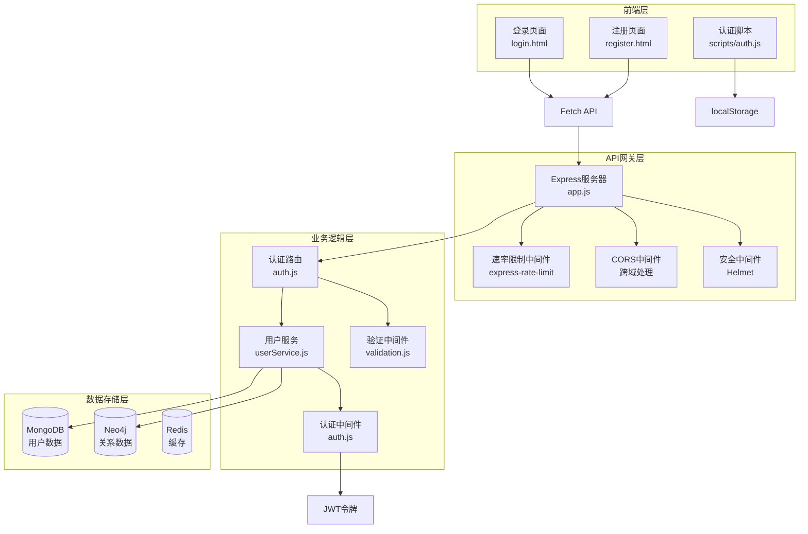
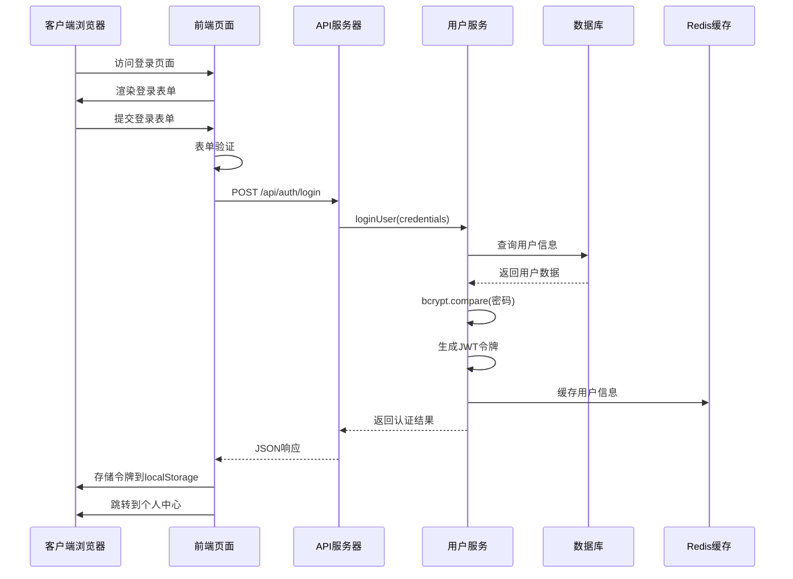
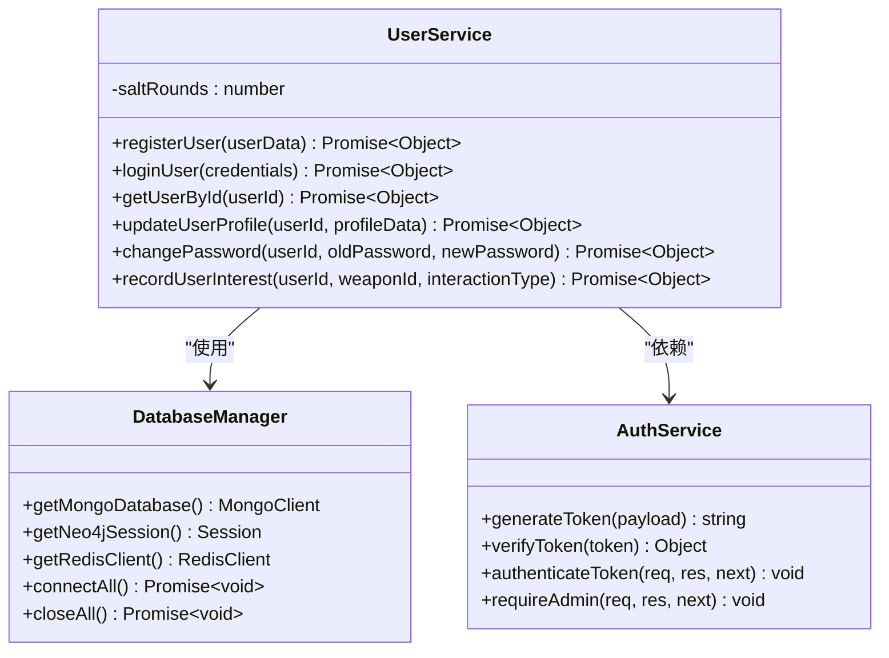
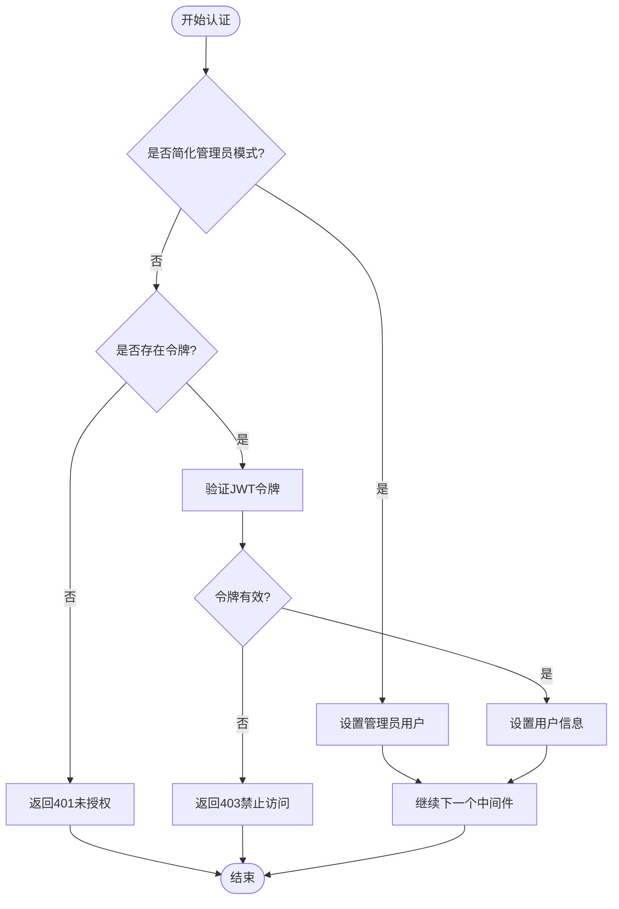
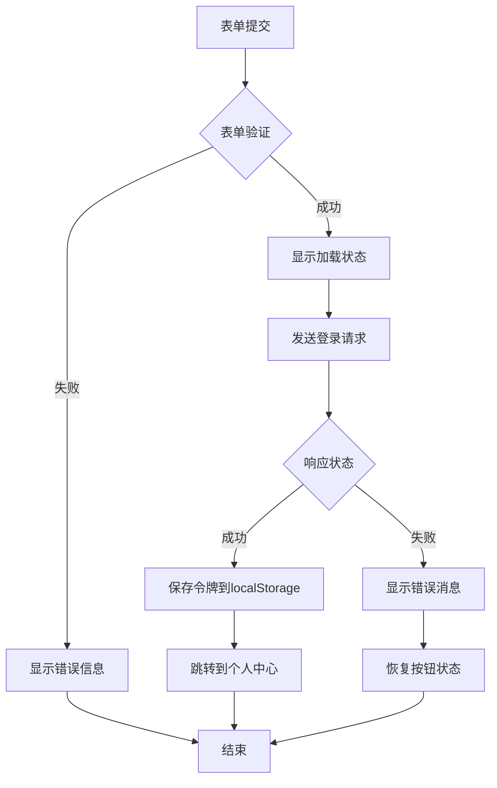
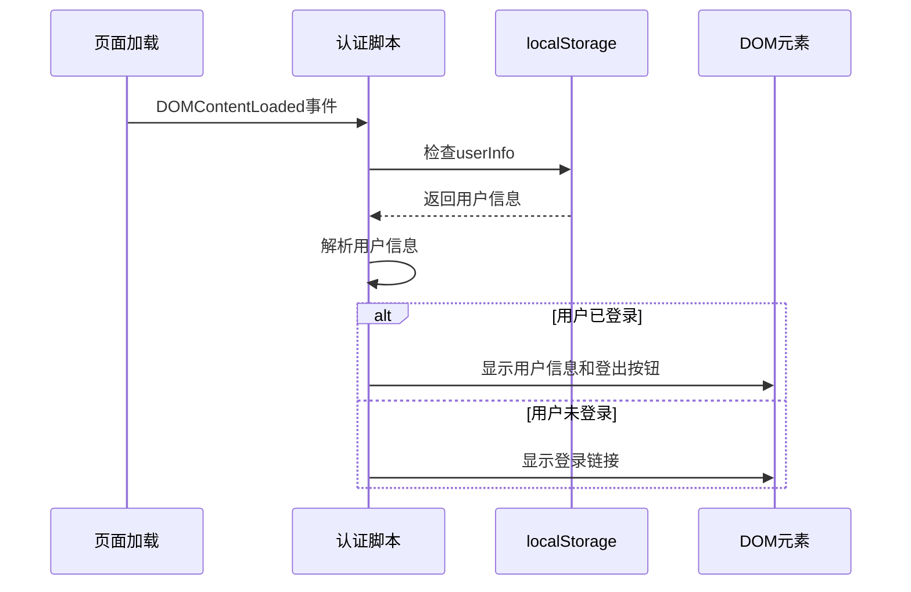
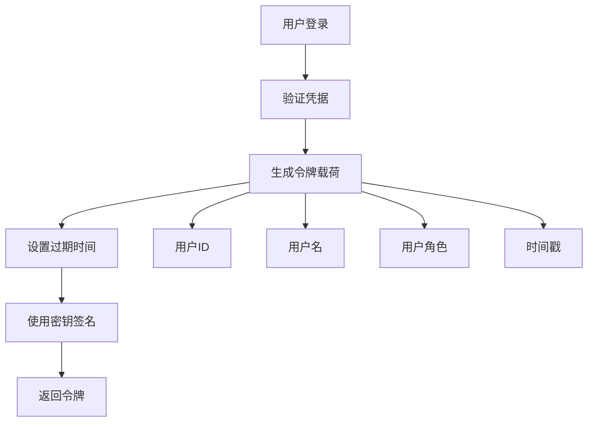
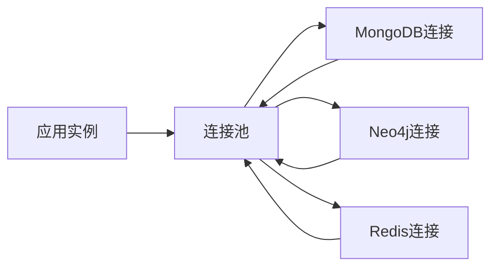

# 用户认证系统详细文档

<cite>
**本文档引用的文件**
- [backend/src/routes/auth.js](file://backend/src/routes/auth.js)
- [backend/src/services/userService.js](file://backend/src/services/userService.js)
- [backend/src/middleware/auth.js](file://backend/src/middleware/auth.js)
- [backend/src/middleware/validation.js](file://backend/src/middleware/validation.js)
- [backend/src/config/index.js](file://backend/src/config/index.js)
- [backend/src/config/database_Neo4j.js](file://backend/src/config/database_Neo4j.js)
- [backend/src/app.js](file://backend/src/app.js)
- [scripts/auth.js](file://scripts/auth.js)
- [login.html](file://login.html)
- [register.html](file://register.html)
- [styles/auth.css](file://styles/auth.css)
</cite>

## 目录
1. [系统概述](#系统概述)
2. [架构设计](#架构设计)
3. [认证流程详解](#认证流程详解)
4. [核心组件分析](#核心组件分析)
5. [前端交互实现](#前端交互实现)
6. [安全机制](#安全机制)
7. [性能优化](#性能优化)
8. [故障排除指南](#故障排除指南)
9. [最佳实践建议](#最佳实践建议)

## 系统概述

兵智世界的用户认证系统采用现代化的前后端分离架构，结合JWT令牌认证、密码哈希加密和多层安全防护机制，为用户提供安全可靠的登录体验。系统支持用户注册、登录、密码管理、令牌刷新等功能，同时具备完善的错误处理和安全防护能力。

### 主要特性

- **JWT令牌认证**：基于JSON Web Token的标准认证机制
- **密码安全**：使用bcryptjs进行密码哈希加密
- **多数据库支持**：MongoDB存储用户数据，Neo4j存储关系数据
- **API限流**：防止暴力破解攻击
- **响应式设计**：适配各种设备的登录界面
- **状态管理**：基于localStorage的用户状态持久化

## 架构设计

### 系统架构图



**图表来源**
- [backend/src/app.js](file://backend/src/app.js#L1-L248)
- [backend/src/routes/auth.js](file://backend/src/routes/auth.js#L1-L144)
- [backend/src/services/userService.js](file://backend/src/services/userService.js#L1-L318)

### 数据流架构



**图表来源**
- [login.html](file://login.html#L50-L119)
- [backend/src/routes/auth.js](file://backend/src/routes/auth.js#L15-L25)
- [backend/src/services/userService.js](file://backend/src/services/userService.js#L60-L130)

## 认证流程详解

### 注册流程

#### 后端注册处理逻辑

注册流程包含多个验证步骤和安全检查：

1. **输入验证**：使用Joi验证器验证用户名、邮箱、密码格式
2. **唯一性检查**：检查用户名和邮箱是否已存在
3. **密码加密**：使用bcryptjs进行密码哈希处理
4. **用户创建**：在MongoDB中创建用户文档
5. **关系数据库同步**：在Neo4j中创建用户节点
6. **令牌生成**：生成JWT访问令牌
7. **响应返回**：返回用户信息和令牌

#### 前端注册交互

前端注册页面实现了完整的表单验证和用户体验优化：

- **实时验证**：用户名格式、密码强度、邮箱格式验证
- **密码确认**：确保两次输入的密码一致
- **加载状态**：提交过程中的按钮状态变化
- **错误提示**：友好的错误信息反馈
- **自动跳转**：注册成功后自动跳转到个人中心

**章节来源**
- [backend/src/routes/auth.js](file://backend/src/routes/auth.js#L8-L15)
- [backend/src/services/userService.js](file://backend/src/services/userService.js#L12-L60)
- [register.html](file://register.html#L40-L126)

### 登录流程

#### 后端登录处理逻辑

登录流程严格遵循安全标准：

1. **凭据验证**：验证用户名和密码格式
2. **用户查找**：根据用户名或邮箱查找用户
3. **密码验证**：使用bcrypt比较输入密码和存储的哈希值
4. **状态检查**：验证用户账户是否激活
5. **登录记录**：更新最后登录时间和更新时间
6. **令牌生成**：生成新的JWT访问令牌
7. **响应构建**：返回用户信息和认证令牌

#### 前端登录交互

前端登录页面提供流畅的用户体验：

- **自动检测**：检查本地存储的认证令牌
- **表单验证**：用户名和密码必填验证
- **错误处理**：详细的错误信息提示
- **状态管理**：登录成功后的状态更新
- **导航控制**：自动跳转到目标页面

**章节来源**
- [backend/src/routes/auth.js](file://backend/src/routes/auth.js#L17-L25)
- [backend/src/services/userService.js](file://backend/src/services/userService.js#L62-L130)
- [login.html](file://login.html#L40-L119)

## 核心组件分析

### 用户服务 (UserService)

用户服务是认证系统的核心业务逻辑层，负责处理所有用户相关的操作。

#### 主要功能模块



**图表来源**
- [backend/src/services/userService.js](file://backend/src/services/userService.js#L6-L318)
- [backend/src/config/database_Neo4j.js](file://backend/src/config/database_Neo4j.js#L6-L141)
- [backend/src/middleware/auth.js](file://backend/src/middleware/auth.js#L1-L106)

#### 密码安全机制

系统采用bcryptjs进行密码哈希处理，确保密码安全：

- **盐值生成**：使用12轮加密强度
- **哈希存储**：存储不可逆的密码哈希值
- **验证机制**：使用bcrypt.compare进行密码验证
- **安全性保证**：防止彩虹表攻击和暴力破解

**章节来源**
- [backend/src/services/userService.js](file://backend/src/services/userService.js#L12-L60)
- [backend/src/services/userService.js](file://backend/src/services/userService.js#L130-L170)

### JWT认证中间件

JWT认证中间件提供完整的令牌验证和权限控制功能。

#### 令牌生成与验证



**图表来源**
- [backend/src/middleware/auth.js](file://backend/src/middleware/auth.js#L6-L48)

#### 权限控制机制

系统支持多种权限控制级别：

- **必需认证**：所有受保护的API都需要有效令牌
- **可选认证**：某些API允许未认证访问
- **管理员权限**：特定功能需要管理员角色
- **简化模式**：开发环境的快速认证模式

**章节来源**
- [backend/src/middleware/auth.js](file://backend/src/middleware/auth.js#L1-L106)

### 输入验证系统

验证系统使用Joi库提供强大的数据验证功能。

#### 验证规则定义

| 验证字段 | 注册验证规则 | 登录验证规则 | 验证要求 |
|---------|-------------|-------------|----------|
| 用户名 | 字母数字，3-30字符 | 必填 | 用户名唯一性 |
| 邮箱 | 有效邮箱格式 | 必填 | 邮箱唯一性 |
| 密码 | 最少6字符，最多128字符 | 必填 | 强度要求 |
| 确认密码 | 与密码一致 | 不适用 | 匹配验证 |

#### 错误处理机制

验证失败时返回详细的错误信息：

- **字段级错误**：明确指出哪个字段验证失败
- **错误消息**：人性化的错误提示信息
- **统一格式**：标准化的错误响应格式

**章节来源**
- [backend/src/middleware/validation.js](file://backend/src/middleware/validation.js#L1-L178)

## 前端交互实现

### 登录页面实现

登录页面采用现代化的响应式设计，提供优秀的用户体验。

#### 表单处理逻辑



**图表来源**
- [login.html](file://login.html#L50-L119)

#### 状态管理

前端使用localStorage进行状态持久化：

- **认证令牌**：存储JWT访问令牌
- **用户信息**：存储用户基本信息和登录状态
- **登录时间**：记录登录时间戳
- **自动检测**：页面加载时检查登录状态

**章节来源**
- [login.html](file://login.html#L1-L120)
- [scripts/auth.js](file://scripts/auth.js#L1-L62)

### 注册页面实现

注册页面提供完整的用户注册体验。

#### 表单验证流程

注册页面实现了多层次的验证机制：

1. **前端验证**：实时验证用户名格式、密码强度、邮箱格式
2. **密码匹配**：确保两次输入的密码一致
3. **后端验证**：服务器端的完整数据验证
4. **唯一性检查**：用户名和邮箱的唯一性验证

#### 用户体验优化

- **即时反馈**：输入过程中的实时验证
- **加载指示**：提交过程中的视觉反馈
- **错误提示**：清晰的错误信息展示
- **自动跳转**：成功后的页面导航

**章节来源**
- [register.html](file://register.html#L1-L127)

### 认证脚本系统

认证脚本提供统一的用户状态管理和页面交互功能。

#### 状态检测机制



**图表来源**
- [scripts/auth.js](file://scripts/auth.js#L5-L35)

#### 登出功能

登出功能提供完整的状态清理：

- **本地清理**：清除localStorage中的用户信息
- **状态更新**：更新页面上的用户状态显示
- **友好提示**：显示登出成功的提示信息
- **页面跳转**：根据当前页面决定跳转目标

**章节来源**
- [scripts/auth.js](file://scripts/auth.js#L37-L62)

## 安全机制

### 密码安全

系统采用多层密码安全机制保护用户账户安全。

#### 密码哈希策略

- **算法选择**：使用bcryptjs作为主要哈希算法
- **盐值强度**：12轮加密强度，提供足够的计算复杂度
- **不可逆性**：密码哈希后无法还原原始密码
- **抗彩虹表**：每个密码使用独立的随机盐值

#### 密码强度要求

| 要求类型 | 具体要求 | 验证位置 |
|---------|---------|----------|
| 长度限制 | 最少6字符，最多128字符 | 前端和后端双重验证 |
| 字符类型 | 支持所有字符组合 | 前端正则表达式验证 |
| 强度检查 | 复杂度由bcrypt保证 | 后端哈希验证 |
| 重复验证 | 确保密码确认一致 | 前端表单验证 |

### JWT令牌安全

#### 令牌生成机制



**图表来源**
- [backend/src/middleware/auth.js](file://backend/src/middleware/auth.js#L70-L78)

#### 令牌验证流程

- **签名验证**：验证令牌的完整性
- **过期检查**：检查令牌是否已过期
- **结构验证**：验证JWT的基本结构
- **安全传输**：通过HTTPS传输令牌

### API安全防护

#### 速率限制机制

系统实现了智能的API速率限制：

- **时间窗口**：15分钟的时间窗口
- **请求限制**：最多1000个请求（可配置）
- **统一限流**：所有API端点共享相同的限制
- **错误响应**：提供友好的限流错误信息

#### CORS配置

- **域名控制**：生产环境限制特定域名
- **凭证支持**：支持跨域认证请求
- **方法白名单**：只允许必要的HTTP方法
- **头部安全**：限制可接受的请求头部

**章节来源**
- [backend/src/config/index.js](file://backend/src/config/index.js#L48-L52)
- [backend/src/app.js](file://backend/src/app.js#L40-L50)

### 数据库安全

#### 多数据库架构

系统采用混合数据库架构提升安全性：

- **MongoDB**：存储用户基本信息和认证数据
- **Neo4j**：存储用户关系和兴趣数据
- **Redis**：提供缓存和会话管理
- **数据隔离**：不同类型的数据分别存储

#### 连接安全

- **连接池**：使用连接池管理数据库连接
- **超时控制**：设置合理的连接超时时间
- **错误处理**：完善的数据库连接错误处理
- **优雅关闭**：服务器关闭时的连接清理

**章节来源**
- [backend/src/config/database_Neo4j.js](file://backend/src/config/database_Neo4j.js#L1-L141)

## 性能优化

### 缓存策略

系统实现了多层缓存机制提升性能。

#### Redis缓存配置

| 缓存类型 | TTL设置 | 用途 | 更新策略 |
|---------|---------|------|----------|
| 默认缓存 | 1小时 | 通用数据缓存 | 自动过期 |
| 知识图谱 | 2小时 | 图谱数据缓存 | 手动失效 |
| 用户数据 | 30分钟 | 用户信息缓存 | 写入时更新 |

#### 缓存命中率优化

- **预热机制**：系统启动时预加载热点数据
- **智能过期**：基于访问频率的动态TTL调整
- **分布式缓存**：支持集群环境下的缓存同步

### 数据库优化

#### 连接管理



**图表来源**
- [backend/src/config/database_Neo4j.js](file://backend/src/config/database_Neo4j.js#L15-L45)

#### 查询优化

- **索引策略**：在用户名和邮箱字段建立唯一索引
- **投影查询**：只查询需要的字段，避免全表扫描
- **事务管理**：合理使用事务保证数据一致性
- **批量操作**：对于大量数据操作使用批量处理

### 前端性能优化

#### 资源加载优化

- **CSS模块化**：分离公共样式和认证专用样式
- **JavaScript压缩**：生产环境的代码压缩和混淆
- **懒加载**：非关键资源的延迟加载
- **CDN支持**：静态资源的CDN加速

#### 用户体验优化

- **即时反馈**：按钮状态的即时变化
- **加载指示**：长时间操作的进度提示
- **错误恢复**：网络错误的自动重试机制
- **离线支持**：有限的离线功能支持

**章节来源**
- [styles/auth.css](file://styles/auth.css#L1-L149)

## 故障排除指南

### 常见问题诊断

#### 登录失败问题

| 错误现象 | 可能原因 | 解决方案 |
|---------|---------|----------|
| 密码错误提示 | 用户名或密码错误 | 检查输入的凭据 |
| 账户被禁用 | 用户状态异常 | 联系管理员检查账户 |
| 网络连接失败 | 网络或服务器问题 | 检查网络连接和服务器状态 |
| 令牌验证失败 | 令牌过期或损坏 | 重新登录获取新令牌 |

#### 注册失败问题

| 错误现象 | 可能原因 | 解决方案 |
|---------|---------|----------|
| 用户名已存在 | 名称已被占用 | 使用其他用户名 |
| 邮箱已存在 | 邮箱地址重复 | 使用不同的邮箱地址 |
| 密码强度不足 | 密码不符合要求 | 增加密码复杂度 |
| 验证失败 | 前端验证未通过 | 检查表单填写格式 |

### 调试工具和技巧

#### 日志分析

系统提供了详细的日志记录功能：

- **请求日志**：记录所有API请求的详细信息
- **错误日志**：记录系统错误和异常信息
- **认证日志**：记录认证相关的操作和状态
- **性能日志**：记录关键操作的执行时间

#### 开发者工具

- **浏览器控制台**：查看JavaScript错误和网络请求
- **网络面板**：分析API请求和响应
- **应用面板**：检查localStorage和sessionStorage
- **性能面板**：分析页面加载和渲染性能

### 环境配置问题

#### 开发环境配置

```bash
# 环境变量配置示例
NODE_ENV=development
PORT=3001
JWT_SECRET=my-secret-key
JWT_EXPIRES_IN=7d
MONGODB_URI=mongodb://localhost:27017/military-knowledge
NEO4J_URI=bolt://localhost:7687
NEO4J_USERNAME=neo4j
NEO4J_PASSWORD=password
REDIS_HOST=localhost
REDIS_PORT=6379
```

#### 生产环境部署

- **环境隔离**：开发、测试、生产环境使用不同的配置
- **安全配置**：启用HTTPS和适当的CORS设置
- **监控配置**：集成监控和日志收集系统
- **备份策略**：定期备份数据库和重要配置

**章节来源**
- [backend/src/app.js](file://backend/src/app.js#L150-L200)

## 最佳实践建议

### 安全最佳实践

#### 密码管理

1. **密码策略**：强制使用强密码，包含大小写字母、数字和特殊字符
2. **定期更换**：建议用户定期更换密码
3. **密码历史**：防止重复使用最近使用的密码
4. **多因素认证**：考虑实施短信验证码或多因子认证

#### 令牌管理

1. **短有效期**：设置合理的令牌过期时间
2. **自动刷新**：实现令牌自动刷新机制
3. **撤销机制**：提供令牌撤销功能
4. **安全存储**：在安全的环境中存储令牌

### 性能最佳实践

#### 缓存策略

1. **分层缓存**：使用多层缓存架构
2. **智能过期**：基于访问模式的动态过期策略
3. **预热机制**：系统启动时预加载热点数据
4. **监控指标**：持续监控缓存命中率和性能指标

#### 数据库优化

1. **索引策略**：为常用查询字段建立适当索引
2. **查询优化**：避免N+1查询问题
3. **连接池**：合理配置数据库连接池大小
4. **读写分离**：对于高并发场景考虑读写分离

### 开发最佳实践

#### 代码质量

1. **单元测试**：为关键功能编写单元测试
2. **集成测试**：测试API端点和数据库交互
3. **代码审查**：实施代码审查流程
4. **文档维护**：保持文档的及时更新

#### 监控和运维

1. **健康检查**：实现全面的健康检查机制
2. **性能监控**：监控系统性能指标
3. **错误追踪**：集成错误追踪系统
4. **容量规划**：基于历史数据进行容量规划

### 用户体验最佳实践

#### 表单设计

1. **实时验证**：提供即时的表单验证反馈
2. **错误提示**：使用清晰易懂的错误信息
3. **加载状态**：长时间操作提供进度指示
4. **响应式设计**：确保在各种设备上良好显示

#### 安全提示

1. **密码强度**：显示密码强度指示器
2. **确认输入**：重要操作要求二次确认
3. **会话超时**：长时间无操作自动登出
4. **安全通知**：账户异常时及时通知用户

### 扩展性考虑

#### 水平扩展

1. **无状态设计**：确保应用的无状态特性
2. **负载均衡**：使用负载均衡器分发请求
3. **数据库分片**：对于大规模数据考虑分片策略
4. **微服务架构**：未来可能的微服务拆分

#### 功能扩展

1. **插件机制**：设计可扩展的功能插件
2. **API版本控制**：支持API的向后兼容性
3. **国际化支持**：为多语言用户提供服务
4. **第三方集成**：支持OAuth等第三方认证

通过遵循这些最佳实践，可以确保兵智世界的用户认证系统不仅安全可靠，而且具有良好的性能和用户体验，为系统的长期发展奠定坚实基础。