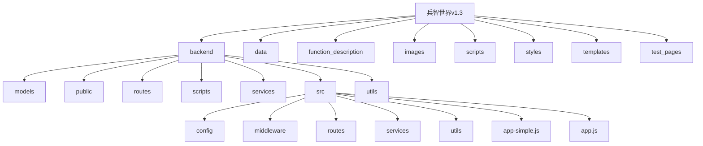
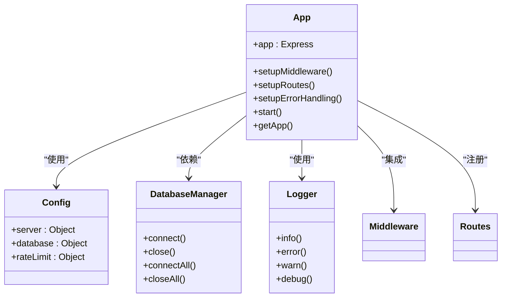
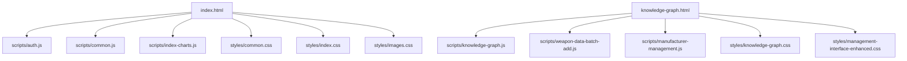
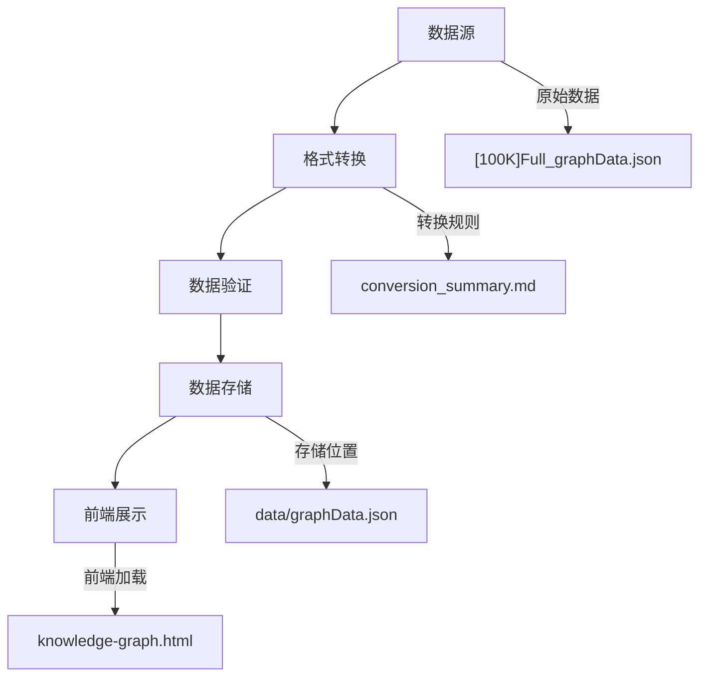
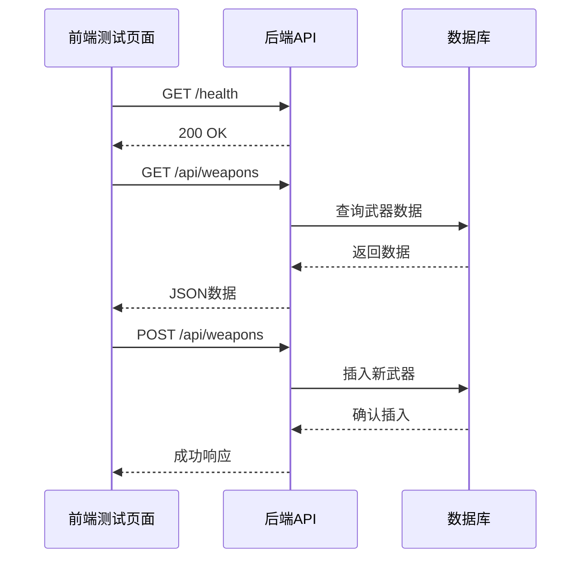

# 目录结构说明

<cite>
**本文档引用的文件**   
- [README.md](file://README.md)
- [backend/app.py](file://backend/app.py)
- [backend/api.py](file://backend/api.py)
- [backend/CONFIG.md](file://backend/CONFIG.md)
- [backend/src/app.js](file://backend/src/app.js)
- [backend/src/app-simple.js](file://backend/src/app-simple.js)
- [backend/routes/auth.py](file://backend/routes/auth.py)
- [backend/routes/knowledge.py](file://backend/routes/knowledge.py)
- [backend/routes/weapon.py](file://backend/routes/weapon.py)
- [index.html](file://index.html)
- [knowledge-graph.html](file://knowledge-graph.html)
- [test_pages/test-frontend-backend-connection.html](file://test_pages/test-frontend-backend-connection.html)
- [function_description/README-数据管理功能.md](file://function_description/README-数据管理功能.md)
- [function_description/前后端连接实现说明.md](file://function_description/前后端连接实现说明.md)
- [data/conversion_summary.md](file://data/conversion_summary.md)
</cite>

## 目录结构说明

兵智世界v1.3项目采用前后端分离的架构设计，整体目录结构清晰，功能模块划分明确。项目主要分为后端服务、数据存储、前端脚本、样式文件、模板文件和测试页面等核心部分，每个目录都有其特定的职责和组织逻辑。

**Diagram sources**
- [README.md](file://README.md#L1-L522)
- [backend/app.py](file://backend/app.py#L1-L43)

**Section sources**
- [README.md](file://README.md#L1-L522)

## 后端代码结构

后端代码主要位于`backend`目录下，采用Python Flask和Node.js Express双框架设计，提供了灵活的部署选项。`backend`目录下的`models`、`routes`、`services`等子目录遵循典型的MVC架构模式，实现了关注点分离。

`backend/src`目录下的`config`、`middleware`、`routes`、`services`和`utils`子模块构成了系统的核心架构。`config`模块负责管理数据库连接和系统配置，`middleware`模块提供身份验证和请求验证等中间件服务，`routes`模块定义了API路由，`services`模块封装了业务逻辑，`utils`模块则包含日志记录等工具函数。

**Diagram sources**
- [backend/src/app.js](file://backend/src/app.js#L1-L248)
- [backend/src/app-simple.js](file://backend/src/app-simple.js#L1-L254)

**Section sources**
- [backend/app.py](file://backend/app.py#L1-L43)
- [backend/api.py](file://backend/api.py#L1-L62)
- [backend/CONFIG.md](file://backend/CONFIG.md#L1-L196)

## 前端代码分布

前端代码分布在项目根目录及`scripts`、`styles`、`templates`等目录中，形成了清晰的前后端分离架构。根目录下的`index.html`、`knowledge-graph.html`等HTML文件作为前端页面入口，通过`<script>`标签引入`scripts`目录中的JavaScript文件，实现交互功能。

`scripts`目录包含了所有前端JavaScript文件，按功能模块组织，如`knowledge-graph.js`负责知识图谱的可视化，`weapon-image-integration.js`处理武器图片的集成，`auth.js`管理用户认证流程。`styles`目录则存放了相应的CSS样式文件，确保了界面的一致性和美观性。

**Diagram sources**
- [index.html](file://index.html#L1-L234)
- [knowledge-graph.html](file://knowledge-graph.html#L1-L603)

**Section sources**
- [index.html](file://index.html#L1-L234)
- [knowledge-graph.html](file://knowledge-graph.html#L1-L603)

## 数据文件与配置

`data`目录存放了系统的核心数据文件，包括`countries.json`国家数据、`graphData.json`知识图谱数据等。这些JSON文件为前端提供了静态数据支持，确保了知识图谱的完整性和准确性。`data/conversion_summary.md`文件详细记录了图数据格式转换的过程和规则，为数据维护提供了重要参考。

`function_description`目录包含了多个功能说明文档，如`README-数据管理功能.md`详细介绍了武器数据管理的各项功能，`前后端连接实现说明.md`则阐述了前后端连接的技术实现细节。这些文档为开发者理解系统功能和进行二次开发提供了宝贵的指导。

**Diagram sources**
- [data/conversion_summary.md](file://data/conversion_summary.md#L1-L113)

**Section sources**
- [data/conversion_summary.md](file://data/conversion_summary.md#L1-L113)
- [function_description/README-数据管理功能.md](file://function_description/README-数据管理功能.md#L1-L241)
- [function_description/前后端连接实现说明.md](file://function_description/前后端连接实现说明.md#L1-L381)

## 测试页面与验证

`test_pages`目录包含了多个测试HTML页面，用于验证系统各项功能的正确性。`test-frontend-backend-connection.html`是前后端连接测试的核心页面，通过一系列测试按钮和结果展示区域，开发者可以直观地检查服务器状态、API端点连通性、武器数据获取、文件上传、数据库操作和统计数据获取等功能。

这些测试页面不仅为系统调试提供了便利，也作为功能演示文档，帮助新开发者快速理解系统的交互流程和API使用方式。测试页面的设计考虑了用户体验，通过颜色编码（绿色表示成功，红色表示失败）和加载动画，提供了清晰的反馈信息。

**Diagram sources**
- [test_pages/test-frontend-backend-connection.html](file://test_pages/test-frontend-backend-connection.html#L1-L523)

**Section sources**
- [test_pages/test-frontend-backend-connection.html](file://test_pages/test-frontend-backend-connection.html#L1-L523)