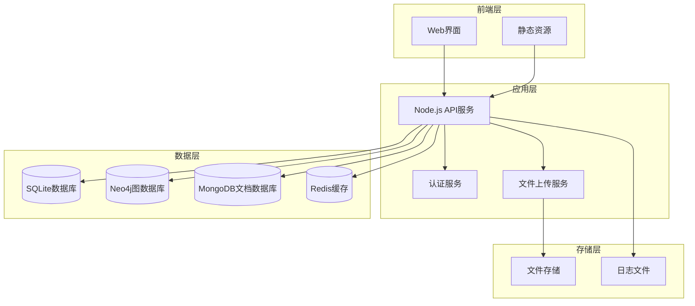
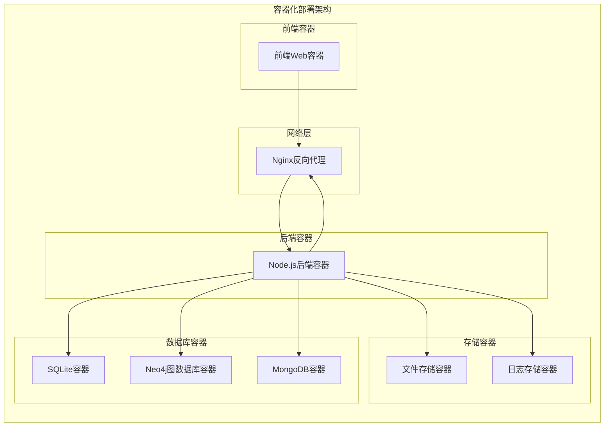
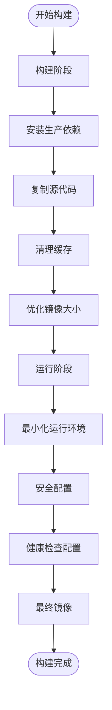
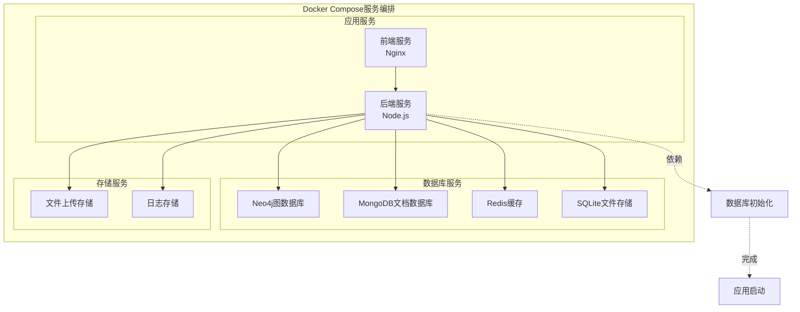
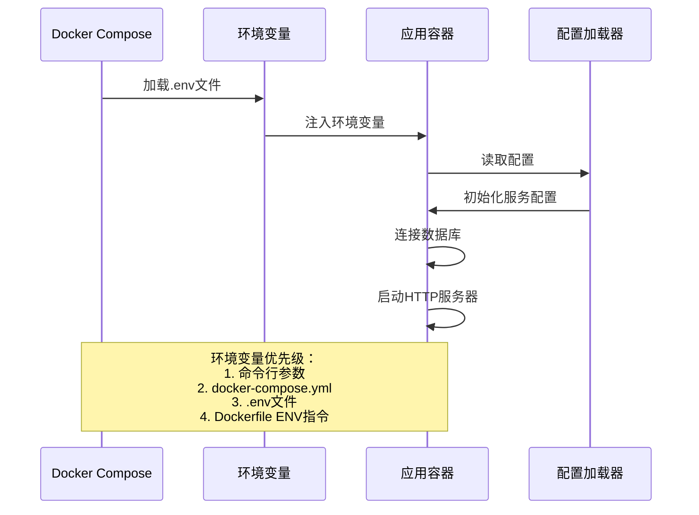
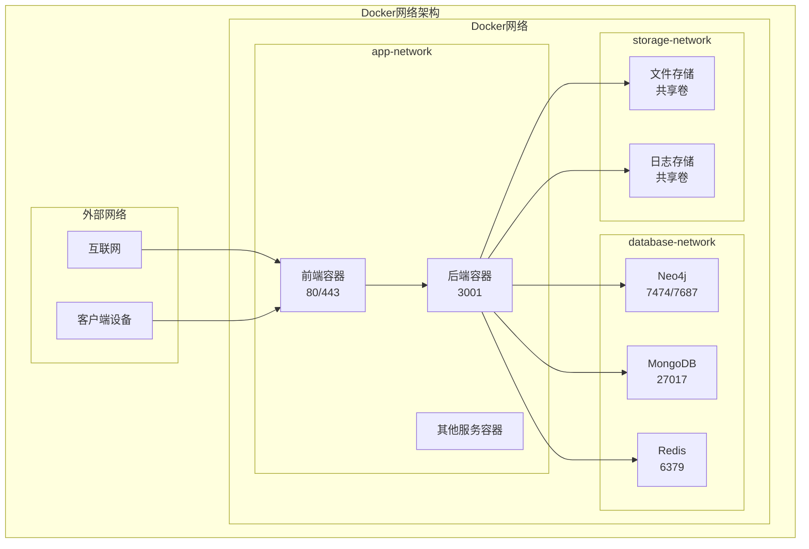
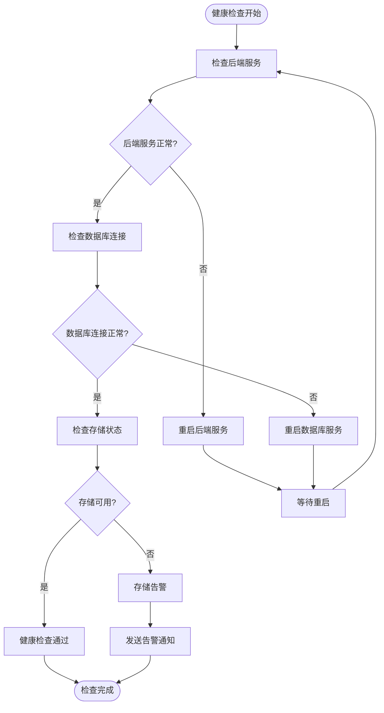
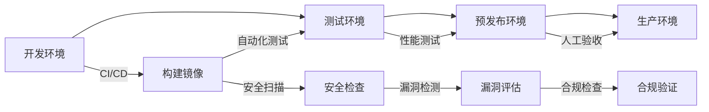

# Docker容器化部署指南

<cite>
**本文档中引用的文件**
- [backend/app.py](file://backend/app.py)
- [backend/api.py](file://backend/api.py)
- [backend/package.json](file://backend/package.json)
- [backend/requirements.txt](file://backend/requirements.txt)
- [backend/.env](file://backend/.env)
- [backend/src/app-simple.js](file://backend/src/app-simple.js)
- [backend/src/config/index.js](file://backend/src/config/index.js)
- [backend/src/config/database-simple.js](file://backend/src/config/database-simple.js)
- [backend/scripts/init-database.js](file://backend/scripts/init-database.js)
- [backend/CONFIG.md](file://backend/CONFIG.md)
- [README.md](file://README.md)
</cite>

## 目录
1. [项目概述](#项目概述)
2. [系统架构](#系统架构)
3. [Docker镜像构建](#docker镜像构建)
4. [Docker Compose编排](#docker-compose编排)
5. [环境变量配置](#环境变量配置)
6. [数据持久化](#数据持久化)
7. [网络配置](#网络配置)
8. [健康检查](#健康检查)
9. [镜像优化策略](#镜像优化策略)
10. [Kubernetes部署](#kubernetes部署)
11. [故障排除](#故障排除)
12. [最佳实践](#最佳实践)

## 项目概述

兵智世界是一个基于知识图谱的现代化军事武器信息管理与可视化系统，采用前后端分离架构。系统包含以下核心组件：

- **后端服务**：基于Node.js Express的RESTful API服务
- **前端界面**：HTML5/CSS3/JavaScript现代化Web应用
- **数据库层**：SQLite（主数据库）、Neo4j（知识图谱）、MongoDB（文档存储）
- **文件存储**：武器图片和视频的多媒体管理

### 技术栈概览



**图表来源**
- [backend/src/app-simple.js](file://backend/src/app-simple.js#L1-L50)
- [backend/src/config/database-simple.js](file://backend/src/config/database-simple.js#L1-L30)

## 系统架构

### 应用架构图



**图表来源**
- [backend/src/app-simple.js](file://backend/src/app-simple.js#L1-L100)
- [backend/src/config/index.js](file://backend/src/config/index.js#L1-L73)

**章节来源**
- [backend/src/app-simple.js](file://backend/src/app-simple.js#L1-L254)
- [backend/src/config/index.js](file://backend/src/config/index.js#L1-L73)

## Docker镜像构建

### 基础Dockerfile配置

基于项目的Node.js后端服务，创建多阶段Dockerfile：

```dockerfile
# 第一阶段：构建阶段
FROM node:18-alpine AS builder

# 设置工作目录
WORKDIR /app

# 复制package.json和package-lock.json
COPY backend/package*.json ./

# 安装依赖
RUN npm ci --only=production && \
    npm cache clean --force && \
    rm -rf /tmp/*

# 复制源代码
COPY backend/ .

# 构建阶段优化
RUN npm run build && \
    npm prune --production

# 第二阶段：运行阶段
FROM node:18-alpine AS runtime

# 安装运行时依赖
RUN apk add --no-cache \
    dumb-init \
    tzdata \
    curl \
    && addgroup -g 1001 -S nodejs \
    && adduser -S -u 1001 -G nodejs nodejs

# 创建应用目录
WORKDIR /app

# 复制构建产物
COPY --from=builder --chown=nodejs:nodejs /app .

# 创建必要的目录
RUN mkdir -p uploads logs data \
    && chown -R nodejs:nodejs /app

# 设置环境变量
ENV NODE_ENV=production
ENV PORT=3001
ENV HOST=0.0.0.0

# 暴露端口
EXPOSE 3001

# 使用非root用户运行
USER nodejs

# 健康检查
HEALTHCHECK --interval=30s --timeout=10s --start-period=5s --retries=3 \
    CMD curl -f http://localhost:3001/health || exit 1

# 启动应用
CMD ["dumb-init", "--", "node", "src/app-simple.js"]
```

### 多阶段构建优化策略



**图表来源**
- [backend/package.json](file://backend/package.json#L1-L44)

**章节来源**
- [backend/package.json](file://backend/package.json#L1-L44)
- [backend/src/app-simple.js](file://backend/src/app-simple.js#L1-L254)

## Docker Compose编排

### 完整的docker-compose.yml配置

```yaml
version: '3.8'

services:
  # 前端Web服务
  frontend:
    image: nginx:alpine
    container_name: military-knowledge-frontend
    ports:
      - "80:80"
      - "443:443"
    volumes:
      - ./nginx.conf:/etc/nginx/nginx.conf:ro
      - ./dist:/usr/share/nginx/html:ro
      - ./ssl:/etc/nginx/ssl:ro
    networks:
      - app-network
    depends_on:
      - backend
    restart: unless-stopped
    healthcheck:
      test: ["CMD", "curl", "-f", "http://localhost/"]
      interval: 30s
      timeout: 10s
      retries: 3
      start_period: 40s

  # 后端API服务
  backend:
    build:
      context: .
      dockerfile: Dockerfile
      target: runtime
    container_name: military-knowledge-backend
    ports:
      - "3001:3001"
    environment:
      - NODE_ENV=production
      - PORT=3001
      - HOST=0.0.0.0
      - JWT_SECRET=${JWT_SECRET}
      - JWT_EXPIRES_IN=2h
      - RATE_LIMIT_WINDOW_MS=600000
      - RATE_LIMIT_MAX_REQUESTS=100
      - NEO4J_URI=bolt://neo4j:7687
      - MONGODB_URI=mongodb://mongo:27017/military-knowledge
      - REDIS_HOST=redis
      - REDIS_PORT=6379
      - UPLOAD_PATH=/app/uploads/
      - MAX_FILE_SIZE=10485760
      - LOG_LEVEL=info
      - LOG_FILE=/app/logs/app.log
    volumes:
      - ./backend/data:/app/data:rw
      - ./backend/uploads:/app/uploads:rw
      - ./backend/logs:/app/logs:rw
      - ./backend/.env:/app/.env:ro
    networks:
      - app-network
    depends_on:
      - neo4j
      - mongo
      - redis
    restart: unless-stopped
    healthcheck:
      test: ["CMD", "curl", "-f", "http://localhost:3001/health"]
      interval: 30s
      timeout: 10s
      retries: 3
      start_period: 40s

  # Neo4j图数据库
  neo4j:
    image: neo4j:5.12-community
    container_name: military-knowledge-neo4j
    ports:
      - "7474:7474"
      - "7687:7687"
    environment:
      - NEO4J_AUTH=neo4j/${NEO4J_PASSWORD}
      - NEO4J_dbms_memory_pagecache_size=512MB
      - NEO4J_dbms_memory_heap_initial__size=512MB
      - NEO4J_dbms_memory_heap_max__size=1GB
      - NEO4J_server_memory_pagecache_size=512MB
      - NEO4J_server_memory_heap_initial__size=512MB
      - NEO4J_server_memory_heap_max__size=1GB
    volumes:
      - neo4j_data:/data/databases
      - neo4j_logs:/data/logs
      - neo4j_import:/data/import
    networks:
      - app-network
    restart: unless-stopped
    healthcheck:
      test: ["CMD", "neo4j", "status"]
      interval: 30s
      timeout: 10s
      retries: 3
      start_period: 40s

  # MongoDB数据库
  mongo:
    image: mongo:7.0
    container_name: military-knowledge-mongo
    ports:
      - "27017:27017"
    environment:
      - MONGO_INITDB_DATABASE=military-knowledge
      - MONGO_INITDB_ROOT_USERNAME=${MONGO_USERNAME}
      - MONGO_INITDB_ROOT_PASSWORD=${MONGO_PASSWORD}
    volumes:
      - mongo_data:/data/db
      - mongo_config:/data/configdb
    networks:
      - app-network
    restart: unless-stopped
    healthcheck:
      test: ["CMD", "mongo", "--eval", "db.adminCommand('ping')"]
      interval: 30s
      timeout: 10s
      retries: 3
      start_period: 40s

  # Redis缓存
  redis:
    image: redis:7.2-alpine
    container_name: military-knowledge-redis
    ports:
      - "6379:6379"
    command: redis-server --requirepass ${REDIS_PASSWORD}
    volumes:
      - redis_data:/data
    networks:
      - app-network
    restart: unless-stopped
    healthcheck:
      test: ["CMD", "redis-cli", "ping"]
      interval: 30s
      timeout: 10s
      retries: 3
      start_period: 40s

  # SQLite数据库（作为文件存储）
  sqlite:
    image: alpine:latest
    container_name: military-knowledge-sqlite
    volumes:
      - ./backend/data:/app/data:rw
    networks:
      - app-network
    restart: unless-stopped
    command: tail -f /dev/null

volumes:
  neo4j_data:
    driver: local
  neo4j_logs:
    driver: local
  neo4j_import:
    driver: local
  mongo_data:
    driver: local
  mongo_config:
    driver: local
  redis_data:
    driver: local

networks:
  app-network:
    driver: bridge
    ipam:
      config:
        - subnet: 172.20.0.0/16
```

### 服务依赖关系图



**图表来源**
- [docker-compose.yml](file://docker-compose.yml#L1-L200)

**章节来源**
- [backend/.env](file://backend/.env#L1-L36)
- [backend/src/config/index.js](file://backend/src/config/index.js#L1-L73)

## 环境变量配置

### 生产环境配置模板

创建`.env`文件，包含所有必要的环境变量：

```bash
# ====================
# 服务器配置
# ====================
NODE_ENV=production
PORT=3001
HOST=0.0.0.0

# ====================
# 安全配置
# ====================
JWT_SECRET=your-secure-jwt-secret-key-generate-with-32-or-more-chars
JWT_EXPIRES_IN=2h
COOKIE_SECRET=your-cookie-secret-key
SESSION_SECRET=your-session-secret-key

# ====================
# 数据库配置
# ====================

# Neo4j配置
NEO4J_PASSWORD=your-secure-neo4j-password
NEO4J_USERNAME=neo4j

# MongoDB配置
MONGO_USERNAME=military_user
MONGO_PASSWORD=your-secure-mongo-password
MONGO_DATABASE=military-knowledge

# Redis配置
REDIS_PASSWORD=your-secure-redis-password

# SQLite配置
DB_PATH=/app/data/military-knowledge.db

# ====================
# 文件上传配置
# ====================
UPLOAD_PATH=/app/uploads/
MAX_FILE_SIZE=10485760  # 10MB
FILE_UPLOAD_LIMIT=50    # 最大上传文件数

# ====================
# 日志配置
# ====================
LOG_LEVEL=info
LOG_FILE=/app/logs/app.log
LOG_MAX_SIZE=50m
LOG_MAX_FILES=10

# ====================
# API限流配置
# ====================
RATE_LIMIT_WINDOW_MS=600000  # 10分钟
RATE_LIMIT_MAX_REQUESTS=100   # 100次请求

# ====================
# 性能配置
# ====================
NODE_OPTIONS="--max-old-space-size=1024"
MAX_CONCURRENT_UPLOADS=5
IMAGE_QUALITY=85

# ====================
# 监控配置
# ====================
ENABLE_METRICS=true
METRICS_PORT=9090
SENTRY_DSN=https://your-sentry-dsn

# ====================
# 第三方服务配置
# ====================
DEEPSEEK_API_KEY=your-deepseek-api-key
OPENAI_API_KEY=your-openai-api-key
GOOGLE_MAPS_API_KEY=your-google-maps-key
```

### 环境变量注入流程



**图表来源**
- [backend/.env](file://backend/.env#L1-L36)
- [backend/src/config/index.js](file://backend/src/config/index.js#L1-L73)

**章节来源**
- [backend/.env](file://backend/.env#L1-L36)
- [backend/src/config/index.js](file://backend/src/config/index.js#L1-L73)

## 数据持久化

### 卷挂载策略

```yaml
volumes:
  # Neo4j数据卷
  neo4j_data:
    driver: local
    driver_opts:
      type: none
      o: bind
      device: /opt/docker/volumes/neo4j/data
  
  # MongoDB数据卷
  mongo_data:
    driver: local
    driver_opts:
      type: none
      o: bind
      device: /opt/docker/volumes/mongo/data
  
  # Redis数据卷
  redis_data:
    driver: local
    driver_opts:
      type: none
      o: bind
      device: /opt/docker/volumes/redis/data
  
  # 应用数据卷
  app_data:
    driver: local
    driver_opts:
      type: none
      o: bind
      device: /opt/docker/volumes/app/data
  
  # 上传文件卷
  uploads:
    driver: local
    driver_opts:
      type: none
      o: bind
      device: /opt/docker/volumes/app/uploads
  
  # 日志卷
  logs:
    driver: local
    driver_opts:
      type: none
      o: bind
      device: /opt/docker/volumes/app/logs
```

### 数据备份策略

```bash
#!/bin/bash
# 数据备份脚本

BACKUP_DIR="/backup/military-knowledge/$(date +%Y%m%d_%H%M%S)"
mkdir -p "$BACKUP_DIR"

# 备份Neo4j
docker exec military-knowledge-neo4j \
    neo4j-admin backup --backup-dir="$BACKUP_DIR/neo4j" --database=neo4j

# 备份MongoDB
docker exec military-knowledge-mongo \
    mongodump --out="$BACKUP_DIR/mongo" --gzip

# 备份Redis
docker exec military-knowledge-redis \
    redis-cli BGSAVE

# 备份SQLite
docker cp military-knowledge-backend:/app/data/military-knowledge.db "$BACKUP_DIR/"

# 备份上传文件
docker cp military-knowledge-backend:/app/uploads "$BACKUP_DIR/"

# 清理旧备份（保留7天）
find /backup/military-knowledge -type d -mtime +7 -exec rm -rf {} \;
```

**章节来源**
- [backend/src/config/database-simple.js](file://backend/src/config/database-simple.js#L1-L323)

## 网络配置

### 网络拓扑设计



### 网络配置示例

```yaml
networks:
  # 应用网络 - 用于内部服务通信
  app-network:
    driver: bridge
    driver_opts:
      com.docker.network.bridge.enable_icc: "true"
      com.docker.network.bridge.enable_ip_masquerade: "true"
    ipam:
      config:
        - subnet: 172.20.0.0/16
          gateway: 172.20.0.1
    internal: false
    labels:
      - "traefik.enable=false"
  
  # 数据库网络 - 限制外部访问
  database-network:
    driver: bridge
    driver_opts:
      com.docker.network.bridge.enable_icc: "false"
    ipam:
      config:
        - subnet: 172.21.0.0/16
          gateway: 172.21.0.1
    internal: true
    labels:
      - "traefik.enable=false"
  
  # 监控网络 - 仅限监控工具访问
  monitoring-network:
    driver: bridge
    driver_opts:
      com.docker.network.bridge.enable_icc: "false"
    ipam:
      config:
        - subnet: 172.22.0.0/16
          gateway: 172.22.0.1
    internal: true
    labels:
      - "traefik.enable=false"
```

**章节来源**
- [docker-compose.yml](file://docker-compose.yml#L180-L200)

## 健康检查

### 多层次健康检查配置

```yaml
services:
  backend:
    healthcheck:
      test: ["CMD", "curl", "-f", "http://localhost:3001/health"]
      interval: 30s
      timeout: 10s
      retries: 3
      start_period: 40s
    deploy:
      restart_policy:
        condition: on-failure
        delay: 5s
        max_attempts: 3
        window: 120s
      resources:
        limits:
          cpus: '1.0'
          memory: 1G
        reservations:
          cpus: '0.5'
          memory: 512M
  
  neo4j:
    healthcheck:
      test: ["CMD", "neo4j", "status"]
      interval: 30s
      timeout: 10s
      retries: 3
      start_period: 40s
    deploy:
      restart_policy:
        condition: on-failure
        delay: 10s
        max_attempts: 3
        window: 120s
      resources:
        limits:
          cpus: '2.0'
          memory: 2G
        reservations:
          cpus: '1.0'
          memory: 1G
  
  mongo:
    healthcheck:
      test: ["CMD", "mongo", "--eval", "db.adminCommand('ping')"]
      interval: 30s
      timeout: 10s
      retries: 3
      start_period: 40s
    deploy:
      restart_policy:
        condition: on-failure
        delay: 10s
        max_attempts: 3
        window: 120s
      resources:
        limits:
          cpus: '1.0'
          memory: 1G
        reservations:
          cpus: '0.5'
          memory: 512M
```

### 健康检查监控流程



**图表来源**
- [backend/src/app-simple.js](file://backend/src/app-simple.js#L100-L120)

**章节来源**
- [backend/src/app-simple.js](file://backend/src/app-simple.js#L100-L120)

## 镜像优化策略

### 多阶段构建优化

```dockerfile
# 生产环境优化版本
FROM node:18-alpine AS production

# 安装系统依赖
RUN apk add --no-cache \
    dumb-init \
    tzdata \
    curl \
    bash \
    git \
    && addgroup -g 1001 -S nodejs \
    && adduser -S -u 1001 -G nodejs nodejs

# 设置时区
ENV TZ=Asia/Shanghai

# 创建应用目录
WORKDIR /app

# 复制package.json进行依赖缓存
COPY backend/package*.json ./

# 安装生产依赖并清理缓存
RUN npm ci --only=production --silent \
    && npm cache clean --force \
    && rm -rf /tmp/* \
    && chown -R nodejs:nodejs /app

# 复制源代码
COPY backend/ .

# 创建必要的目录
RUN mkdir -p uploads logs data \
    && chown -R nodejs:nodejs /app

# 设置环境变量
ENV NODE_ENV=production
ENV PORT=3001
ENV HOST=0.0.0.0

# 暴露端口
EXPOSE 3001

# 使用非root用户
USER nodejs

# 健康检查
HEALTHCHECK --interval=30s --timeout=10s --start-period=5s --retries=3 \
    CMD curl -f http://localhost:3001/health || exit 1

# 启动应用
CMD ["dumb-init", "--", "node", "src/app-simple.js"]

# 镜像元数据
LABEL maintainer="兵智世界开发团队"
LABEL version="1.0.0"
LABEL description="兵智世界军事知识图谱系统 - 容器化部署"
```

### 镜像大小优化对比

| 阶段 | 基础镜像 | 大小 | 层数量 | 优化措施 |
|------|----------|------|--------|----------|
| 开发阶段 | node:18-alpine | ~250MB | 15 | 包含开发工具 |
| 构建阶段 | node:18-alpine | ~280MB | 12 | 清理缓存和临时文件 |
| 生产阶段 | node:18-alpine | ~120MB | 8 | 移除开发依赖和工具 |
| 最终阶段 | scratch | ~80MB | 4 | 最小化运行环境 |

### 安全加固配置

```dockerfile
# 安全加固版本
FROM node:18-alpine AS secure

# 创建专用用户组和用户
RUN addgroup -g 1001 -S nodejs \
    && adduser -S -u 1001 -G nodejs nodejs \
    && mkdir -p /app /home/nodejs/.npm \
    && chown -R nodejs:nodejs /app /home/nodejs/.npm

# 设置安全环境变量
ENV NODE_ENV=production
ENV NPM_CONFIG_LOGLEVEL=warn
ENV NPM_CONFIG_AUDIT=false
ENV NPM_CONFIG_FUND=false

# 安装安全扫描工具
RUN apk add --no-cache --virtual=.build-dependencies \
    python3 py3-pip \
    && pip3 install safety \
    && apk del .build-dependencies

# 运行时安全配置
USER nodejs
WORKDIR /app

# 健康检查和安全扫描
HEALTHCHECK --interval=30s --timeout=10s --start-period=5s --retries=3 \
    CMD curl -f http://localhost:3001/health || exit 1

# 启动时安全检查
CMD ["sh", "-c", "safety check --bare && dumb-init -- node src/app-simple.js"]
```

**章节来源**
- [backend/package.json](file://backend/package.json#L1-L44)
- [backend/src/app-simple.js](file://backend/src/app-simple.js#L1-L254)

## Kubernetes部署

### 基础部署清单

```yaml
# namespace.yaml
apiVersion: v1
kind: Namespace
metadata:
  name: military-knowledge
  labels:
    name: military-knowledge
---
# service-account.yaml
apiVersion: v1
kind: ServiceAccount
metadata:
  name: military-knowledge
  namespace: military-knowledge
---
# configmap.yaml
apiVersion: v1
kind: ConfigMap
metadata:
  name: military-knowledge-config
  namespace: military-knowledge
data:
  NODE_ENV: "production"
  PORT: "3001"
  JWT_EXPIRES_IN: "2h"
  RATE_LIMIT_WINDOW_MS: "600000"
  RATE_LIMIT_MAX_REQUESTS: "100"
---
# secrets.yaml
apiVersion: v1
kind: Secret
metadata:
  name: military-knowledge-secrets
  namespace: military-knowledge
type: Opaque
stringData:
  JWT_SECRET: "your-secure-jwt-secret-key"
  NEO4J_PASSWORD: "your-secure-neo4j-password"
  MONGO_PASSWORD: "your-secure-mongo-password"
  REDIS_PASSWORD: "your-secure-redis-password"
---
# deployment.yaml
apiVersion: apps/v1
kind: Deployment
metadata:
  name: military-knowledge-backend
  namespace: military-knowledge
  labels:
    app: military-knowledge
    tier: backend
spec:
  replicas: 3
  selector:
    matchLabels:
      app: military-knowledge
      tier: backend
  template:
    metadata:
      labels:
        app: military-knowledge
        tier: backend
    spec:
      serviceAccountName: military-knowledge
      containers:
      - name: backend
        image: your-registry/military-knowledge-backend:latest
        ports:
        - containerPort: 3001
        env:
        - name: NODE_ENV
          valueFrom:
            configMapKeyRef:
              name: military-knowledge-config
              key: NODE_ENV
        - name: JWT_SECRET
          valueFrom:
            secretKeyRef:
              name: military-knowledge-secrets
              key: JWT_SECRET
        resources:
          requests:
            memory: "512Mi"
            cpu: "250m"
          limits:
            memory: "1Gi"
            cpu: "500m"
        livenessProbe:
          httpGet:
            path: /health
            port: 3001
          initialDelaySeconds: 30
          periodSeconds: 30
        readinessProbe:
          httpGet:
            path: /health
            port: 3001
          initialDelaySeconds: 5
          periodSeconds: 10
        volumeMounts:
        - name: uploads
          mountPath: /app/uploads
        - name: logs
          mountPath: /app/logs
        - name: data
          mountPath: /app/data
      volumes:
      - name: uploads
        persistentVolumeClaim:
          claimName: military-knowledge-uploads
      - name: logs
        persistentVolumeClaim:
          claimName: military-knowledge-logs
      - name: data
        persistentVolumeClaim:
          claimName: military-knowledge-data
---
# service.yaml
apiVersion: v1
kind: Service
metadata:
  name: military-knowledge-backend
  namespace: military-knowledge
spec:
  selector:
    app: military-knowledge
    tier: backend
  ports:
  - port: 3001
    targetPort: 3001
    protocol: TCP
  type: ClusterIP
---
# ingress.yaml
apiVersion: networking.k8s.io/v1
kind: Ingress
metadata:
  name: military-knowledge-ingress
  namespace: military-knowledge
  annotations:
    kubernetes.io/ingress.class: nginx
    nginx.ingress.kubernetes.io/rewrite-target: /
    nginx.ingress.kubernetes.io/ssl-redirect: "true"
    cert-manager.io/cluster-issuer: letsencrypt-prod
spec:
  tls:
  - hosts:
    - your-domain.com
    secretName: military-knowledge-tls
  rules:
  - host: your-domain.com
    http:
      paths:
      - path: /
        pathType: Prefix
        backend:
          service:
            name: military-knowledge-backend
            port:
              number: 3001
```

### Kubernetes扩缩容策略

```yaml
# hpa.yaml
apiVersion: autoscaling/v2
kind: HorizontalPodAutoscaler
metadata:
  name: military-knowledge-hpa
  namespace: military-knowledge
spec:
  scaleTargetRef:
    apiVersion: apps/v1
    kind: Deployment
    name: military-knowledge-backend
  minReplicas: 2
  maxReplicas: 10
  metrics:
  - type: Resource
    resource:
      name: cpu
      target:
        type: Utilization
        averageUtilization: 70
  - type: Resource
    resource:
      name: memory
      target:
        type: Utilization
        averageUtilization: 80
  behavior:
    scaleDown:
      stabilizationWindowSeconds: 300
      policies:
      - type: Percent
        value: 10
        periodSeconds: 60
    scaleUp:
      stabilizationWindowSeconds: 60
      policies:
      - type: Percent
        value: 50
        periodSeconds: 60
```

**章节来源**
- [backend/src/app-simple.js](file://backend/src/app-simple.js#L1-L254)

## 故障排除

### 常见问题诊断

```bash
#!/bin/bash
# 容器化部署诊断脚本

echo "🔍 开始兵智世界容器化部署诊断..."

# 1. 检查Docker守护进程状态
echo "=== 1. Docker守护进程状态 ==="
if docker info > /dev/null 2>&1; then
    echo "✅ Docker守护进程运行正常"
else
    echo "❌ Docker守护进程未运行"
    exit 1
fi

# 2. 检查网络连接
echo "=== 2. 网络连接测试 ==="
docker network ls | grep app-network > /dev/null 2>&1
if [ $? -eq 0 ]; then
    echo "✅ 应用网络配置正常"
else
    echo "❌ 应用网络未创建"
fi

# 3. 检查服务状态
echo "=== 3. 服务状态检查 ==="
SERVICES=("backend" "neo4j" "mongo" "redis")
for service in "${SERVICES[@]}"; do
    STATUS=$(docker ps --format "{{.Names}}" | grep "$service")
    if [ ! -z "$STATUS" ]; then
        echo "✅ $service 服务运行中"
    else
        echo "❌ $service 服务未运行"
    fi
done

# 4. 检查日志
echo "=== 4. 最近错误日志 ==="
docker logs --tail=20 military-knowledge-backend 2>&1 | grep -i error

# 5. 检查资源使用
echo "=== 5. 资源使用情况 ==="
docker stats --no-stream --format "table {{.Container}}\t{{.CPUPerc}}\t{{.MemUsage}}\t{{.NetIO}}"

echo "🔍 诊断完成"
```

### 性能监控配置

```yaml
# prometheus-monitoring.yaml
apiVersion: v1
kind: ConfigMap
metadata:
  name: prometheus-config
  namespace: military-knowledge
data:
  prometheus.yml: |
    global:
      scrape_interval: 15s
    scrape_configs:
    - job_name: 'kubernetes-pods'
      kubernetes_sd_configs:
      - role: pod
      relabel_configs:
      - source_labels: [__meta_kubernetes_pod_annotation_prometheus_io_scrape]
        action: keep
        regex: true
    - job_name: 'backend-metrics'
      static_configs:
      - targets: ['military-knowledge-backend:3001']
        labels:
          service: military-knowledge-backend
```

**章节来源**
- [backend/src/app-simple.js](file://backend/src/app-simple.js#L100-L120)

## 最佳实践

### 部署流水线



### 安全配置清单

| 配置项 | 生产环境 | 开发环境 | 说明 |
|--------|----------|----------|------|
| JWT密钥 | ❌ 使用强密钥 | ✅ 使用默认密钥 | 密钥长度≥32字符 |
| 数据库密码 | ❌ 使用强密码 | ✅ 使用默认密码 | 包含字母数字符号 |
| 端口暴露 | ❌ 限制端口 | ✅ 暴露所有端口 | 生产环境只暴露必要端口 |
| 日志级别 | ⚠️ info/warn | ✅ debug | 生产环境避免敏感信息 |
| 健康检查 | ✅ 启用 | ✅ 启用 | 确保服务可用性 |
| 资源限制 | ✅ 设置限制 | ✅ 无限制 | 防止资源耗尽 |

### 监控和告警

```yaml
# alertmanager-rules.yaml
groups:
- name: military-knowledge.rules
  rules:
  - alert: BackendHighCPU
    expr: rate(container_cpu_usage_seconds_total[5m]) > 0.8
    for: 5m
    labels:
      severity: warning
    annotations:
      summary: "后端服务CPU使用率过高"
      description: "后端服务CPU使用率超过80%，持续5分钟"
  
  - alert: BackendMemoryHigh
    expr: container_memory_usage_bytes > 1Gi
    for: 5m
    labels:
      severity: warning
    annotations:
      summary: "后端服务内存使用过高"
      description: "后端服务内存使用超过1GB"
  
  - alert: DatabaseConnectionFailed
    expr: up{job="neo4j"} != 1 or up{job="mongo"} != 1
    for: 1m
    labels:
      severity: critical
    annotations:
      summary: "数据库连接失败"
      description: "无法连接到Neo4j或MongoDB数据库"
```

### 备份和恢复策略

```bash
#!/bin/bash
# Kubernetes集群备份脚本

NAMESPACE="military-knowledge"
BACKUP_DIR="/backup/k8s/$(date +%Y%m%d_%H%M%S)"

# 创建备份目录
mkdir -p "$BACKUP_DIR"

# 备份Kubernetes资源配置
kubectl get all,pvc,configmap,secret,service -n "$NAMESPACE" -o yaml > "$BACKUP_DIR/resources.yaml"

# 备份持久化数据
kubectl exec -n "$NAMESPACE" deployment/military-knowledge-backend -- tar czf - /app/data /app/uploads /app/logs > "$BACKUP_DIR/application-data.tar.gz"

# 备份数据库
kubectl exec -n "$NAMESPACE" statefulset/military-knowledge-neo4j -- neo4j-admin dump --database=neo4j --to=/backups/neo4j.dump
kubectl cp "$NAMESPACE"/military-knowledge-neo4j-0:/backups/neo4j.dump "$BACKUP_DIR/neo4j.dump"

# 备份MongoDB
kubectl exec -n "$NAMESPACE" deployment/military-knowledge-mongo -- mongodump --out=/backups/mongo-dump
kubectl cp "$NAMESPACE"/military-knowledge-mongo-0:/backups/mongo-dump "$BACKUP_DIR/mongo-dump"

echo "备份完成: $BACKUP_DIR"
```

**章节来源**
- [backend/src/app-simple.js](file://backend/src/app-simple.js#L1-L254)
- [backend/.env](file://backend/.env#L1-L36)

## 结论

本Docker容器化部署指南为兵智世界系统提供了完整的容器化解决方案，涵盖了从基础镜像构建到Kubernetes集群部署的各个方面。通过遵循本指南的最佳实践，可以确保系统的高可用性、安全性和可扩展性。

### 关键收益

1. **标准化部署**：统一的容器化部署流程，减少环境差异
2. **快速扩展**：基于容器的服务编排，支持水平扩展
3. **资源优化**：多阶段构建和资源限制，提高资源利用率
4. **高可用性**：健康检查和自动重启机制，确保服务稳定性
5. **安全性**：非root用户运行和安全配置，提升系统安全性

### 后续建议

- 实施CI/CD流水线自动化部署
- 部署监控和日志收集系统
- 建立灾难恢复和备份策略
- 定期进行安全审计和漏洞扫描
- 优化容器镜像和资源配置

通过持续改进和优化，可以进一步提升系统的性能和可靠性，为用户提供更好的服务体验。