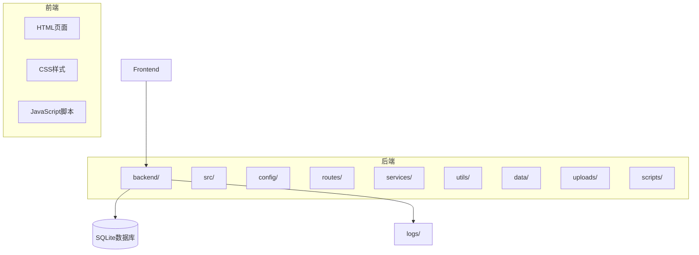
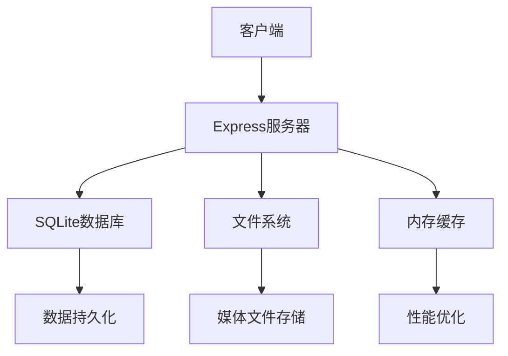
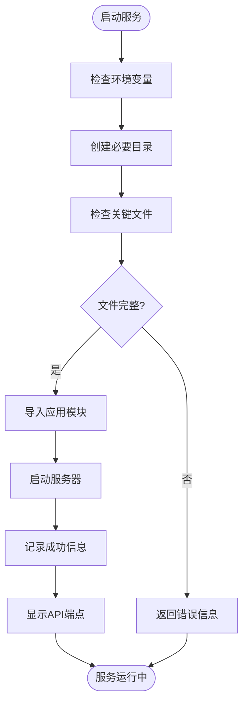
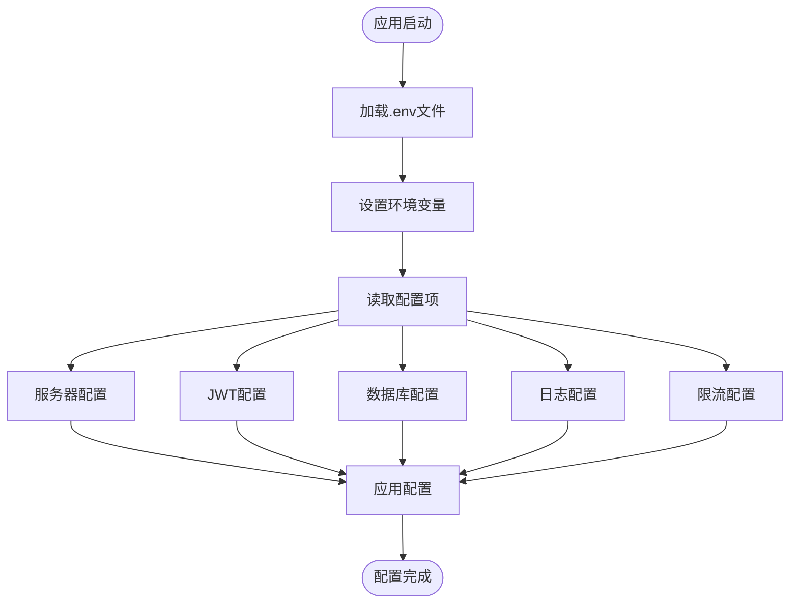
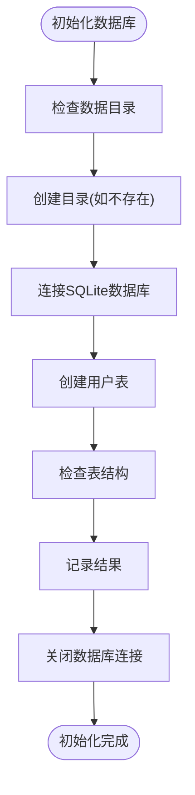
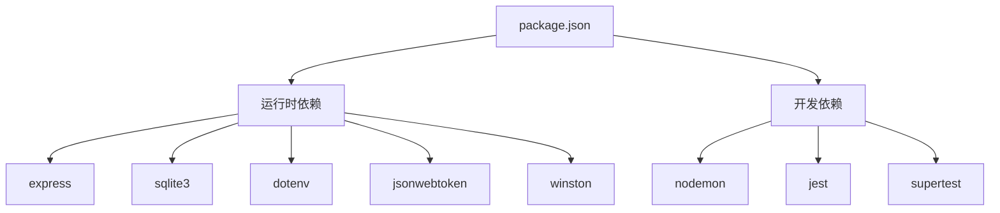

# 开发环境部署

<cite>
**本文档引用的文件**  
- [package.json](file://backend/package.json)
- [.env](file://backend/.env)
- [init-db.js](file://backend/init-db.js)
- [start-simple-server.js](file://start-simple-server.js)
- [app.js](file://backend/src/app.js)
- [app-simple.js](file://backend/src/app-simple.js)
- [index.js](file://backend/src/config/index.js)
- [database-simple.js](file://backend/src/config/database-simple.js)
- [README.md](file://README.md)
- [CONFIG.md](file://backend/CONFIG.md)
- [README-SIMPLE.md](file://backend/README-SIMPLE.md)
</cite>

## 目录

1. [简介](#简介)
2. [项目结构](#项目结构)
3. [核心组件](#核心组件)
4. [架构概述](#架构概述)
5. [详细组件分析](#详细组件分析)
6. [依赖分析](#依赖分析)
7. [性能考虑](#性能考虑)
8. [故障排除指南](#故障排除指南)
9. [结论](#结论)

## 简介

本文档提供了兵智世界v1.3项目的完整开发环境部署指南，涵盖Windows、Linux和macOS平台的配置步骤。文档详细说明了如何启动服务、配置环境变量、初始化数据库以及监控日志输出。同时提供了常见启动错误的排查方法和解决方案。

## 项目结构

兵智世界项目采用前后端分离的架构设计，后端服务基于Node.js和Express框架，前端页面使用HTML、CSS和JavaScript构建。项目结构清晰，模块化程度高，便于开发和维护。

**Diagram sources**
- [README.md](file://README.md#L1-L522)

**Section sources**
- [README.md](file://README.md#L1-L522)

## 核心组件

本项目的核心组件包括简化版后端服务器、数据库初始化脚本、环境配置文件和快速启动脚本。这些组件共同构成了开发环境的基础，确保系统能够快速部署和运行。

**Section sources**
- [package.json](file://backend/package.json#L1-L44)
- [app-simple.js](file://backend/src/app-simple.js#L1-L254)
- [start-simple-server.js](file://start-simple-server.js#L1-L78)

## 架构概述

兵智世界系统采用现代化的技术栈，后端基于Node.js + Express.js框架，使用SQLite作为轻量级关系数据库，实现了用户认证、武器数据管理、知识图谱可视化等核心功能。系统设计注重性能优化和开发友好性，适合快速开发和测试。

**Diagram sources**
- [README-SIMPLE.md](file://backend/README-SIMPLE.md#L1-L268)

**Section sources**
- [README-SIMPLE.md](file://backend/README-SIMPLE.md#L1-L268)

## 详细组件分析

### 后端服务启动分析

兵智世界提供两种后端服务启动方式：通过app.js或app-simple.js直接启动，以及通过start-simple-server.js脚本快速启动。简化版服务器使用SQLite数据库，适合开发和演示环境。

#### 服务启动流程

**Diagram sources**
- [start-simple-server.js](file://start-simple-server.js#L1-L78)

**Section sources**
- [start-simple-server.js](file://start-simple-server.js#L1-L78)

### 环境配置分析

环境配置通过.env文件实现，系统在启动时自动加载这些配置。配置文件包含了服务器端口、JWT密钥、数据库路径、日志级别等关键参数，支持开发和生产环境的不同配置需求。

#### 环境变量配置流程

**Diagram sources**
- [.env](file://backend/.env#L1-L36)
- [index.js](file://backend/src/config/index.js#L1-L73)

**Section sources**
- [.env](file://backend/.env#L1-L36)
- [index.js](file://backend/src/config/index.js#L1-L73)

### 数据库初始化分析

数据库初始化通过init-db.js脚本完成，该脚本创建SQLite数据库文件和必要的数据表结构。系统使用better-sqlite3驱动，确保了数据库操作的高性能和可靠性。

#### 数据库初始化流程

**Diagram sources**
- [init-db.js](file://backend/init-db.js#L1-L45)

**Section sources**
- [init-db.js](file://backend/init-db.js#L1-L45)

## 依赖分析

项目依赖管理通过package.json文件实现，包含了运行时依赖和开发依赖。系统使用npm作为包管理器，确保了依赖的可重现性和版本控制。

**Diagram sources**
- [package.json](file://backend/package.json#L1-L44)

**Section sources**
- [package.json](file://backend/package.json#L1-L44)

## 性能考虑

系统在设计时充分考虑了性能优化，采用了多种技术手段来提升响应速度和用户体验。内存缓存替代Redis，查询优化和数据索引确保了数据库操作的高效性。

### 性能优化策略
- **内存缓存**: 热点查询结果缓存1小时
- **查询优化**: SQLite索引优化查询性能
- **数据预加载**: 启动时预加载常用数据
- **压缩响应**: 使用compression中间件压缩HTTP响应
- **API限流**: 防止API被恶意调用

[无具体文件来源，为通用性能建议]

## 故障排除指南

### 常见启动错误及解决方案

#### 端口占用问题
**问题描述**: 启动服务时出现"EADDRINUSE"错误，表示端口已被占用。
**解决方案**:
1. 修改.env文件中的PORT配置
2. 使用命令行查找并终止占用端口的进程
   - Windows: `netstat -ano | findstr :3001` 然后 `taskkill /PID <进程ID> /F`
   - Linux/macOS: `lsof -i :3001` 然后 `kill -9 <进程ID>`

**Section sources**
- [.env](file://backend/.env#L1-L36)

#### 依赖缺失问题
**问题描述**: 启动服务时出现"Module not found"错误，表示依赖包缺失。
**解决方案**:
1. 确保在backend目录下运行`npm install`
2. 如果问题持续存在，删除node_modules目录和package-lock.json文件后重新安装
3. 检查npm源是否正常，必要时更换为国内镜像源

**Section sources**
- [package.json](file://backend/package.json#L1-L44)

#### Node.js版本不兼容问题
**问题描述**: 启动服务时出现语法错误或模块加载失败。
**解决方案**:
1. 检查Node.js版本是否满足项目要求(Node.js >= 16.0.0)
2. 使用nvm(Node Version Manager)管理多个Node.js版本
3. 在项目根目录创建.nvmrc文件指定Node.js版本

**Section sources**
- [README-SIMPLE.md](file://backend/README-SIMPLE.md#L1-L268)

#### 数据库权限问题
**问题描述**: 启动服务时出现"EACCES"错误，表示没有文件写入权限。
**解决方案**:
1. 确保data/和logs/目录有写入权限
2. 在Linux/macOS系统上使用`chmod 755 backend/data`和`chmod 755 backend/logs`命令修改权限
3. 在Windows系统上检查文件夹属性，确保当前用户有完全控制权限

**Section sources**
- [CONFIG.md](file://backend/CONFIG.md#L1-L196)

#### 环境变量配置错误
**问题描述**: 服务启动后无法正常工作，可能是环境变量配置错误。
**解决方案**:
1. 检查.env文件中的JWT_SECRET是否足够长(建议32位以上)
2. 确认PORT配置是否在有效范围内(1024-65535)
3. 使用`console.log(process.env)`调试环境变量加载情况

**Section sources**
- [.env](file://backend/.env#L1-L36)
- [index.js](file://backend/src/config/index.js#L1-L73)

## 结论

兵智世界v1.3项目提供了一套完整的开发环境部署方案，通过详细的配置文件、自动化脚本和清晰的文档，大大降低了开发环境的搭建难度。系统设计合理，性能优化到位，适合快速开发和测试。建议开发者按照本文档的指引逐步完成环境配置，遇到问题时参考故障排除指南进行解决。

[无具体文件来源，为总结性内容]