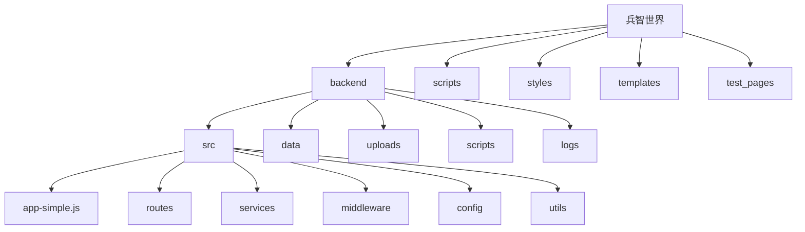
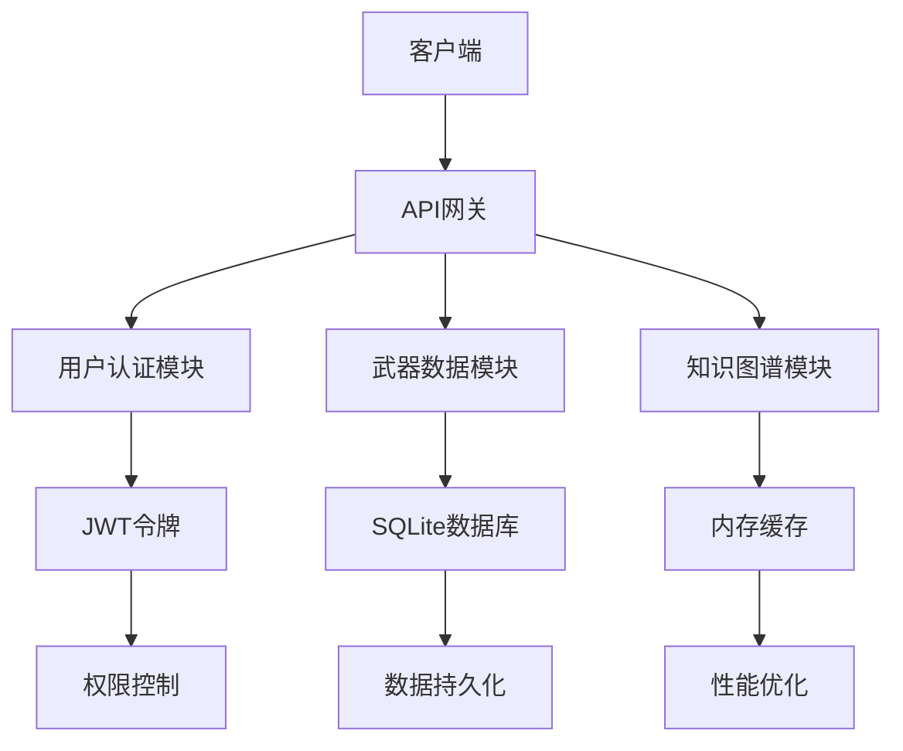
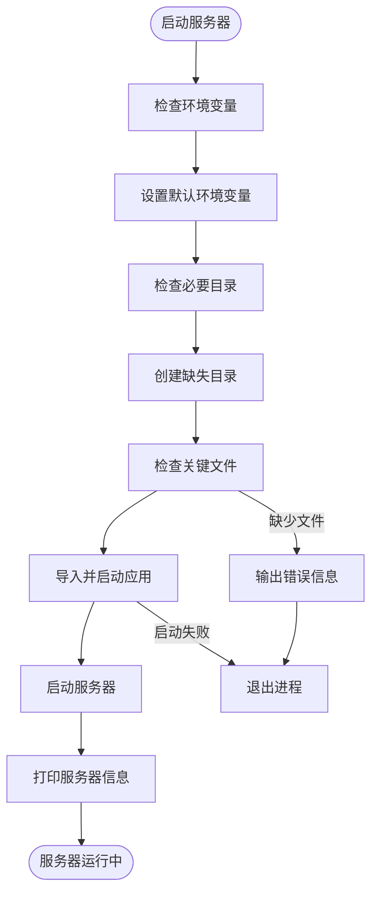
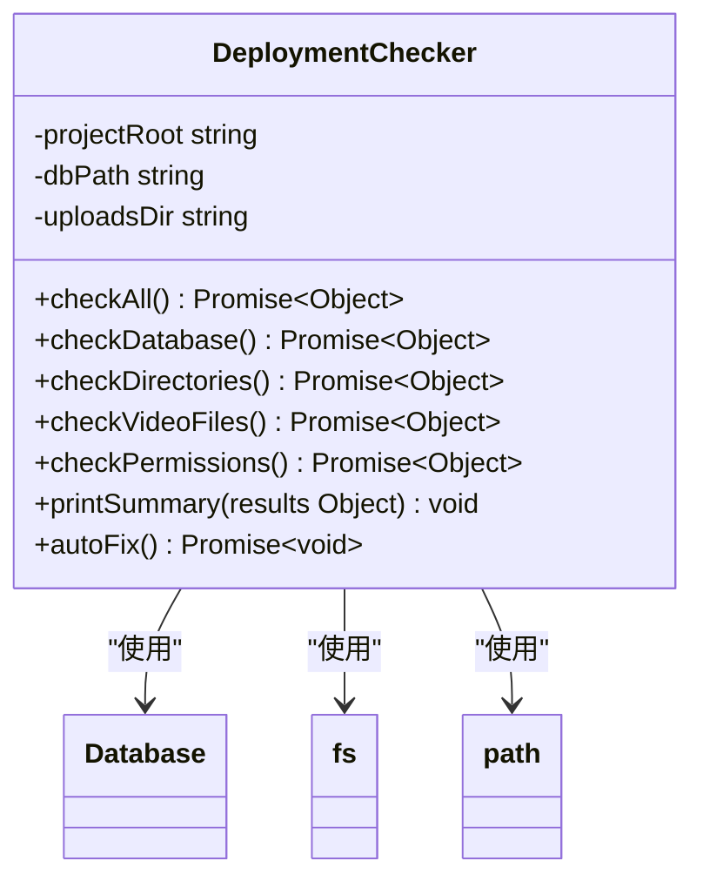
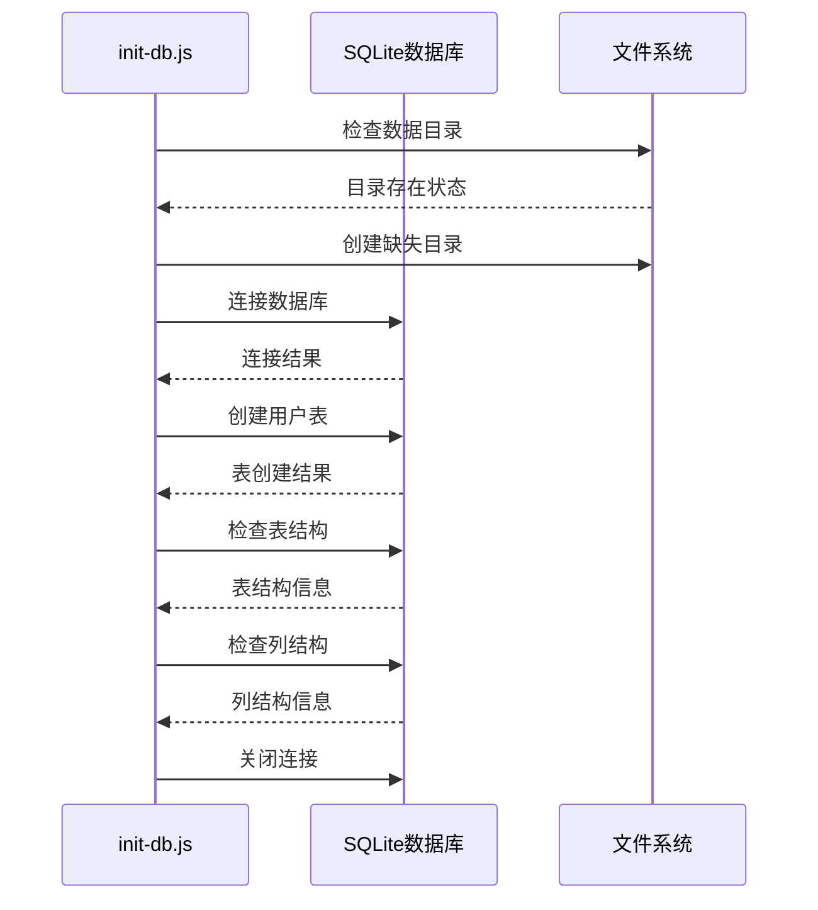
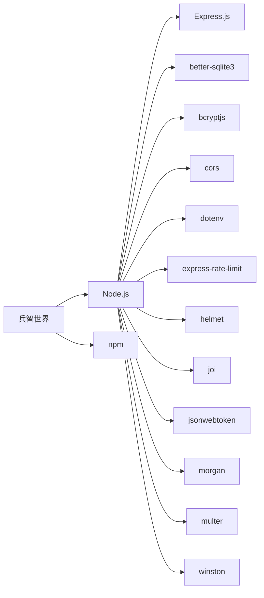
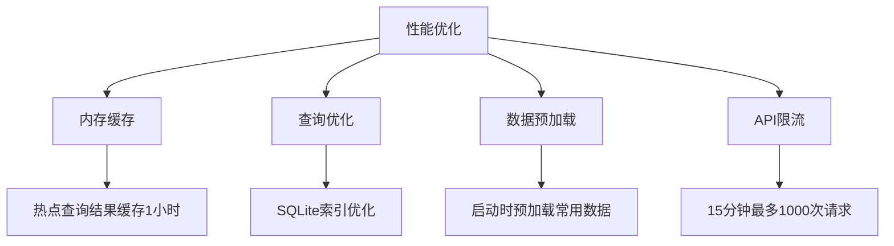
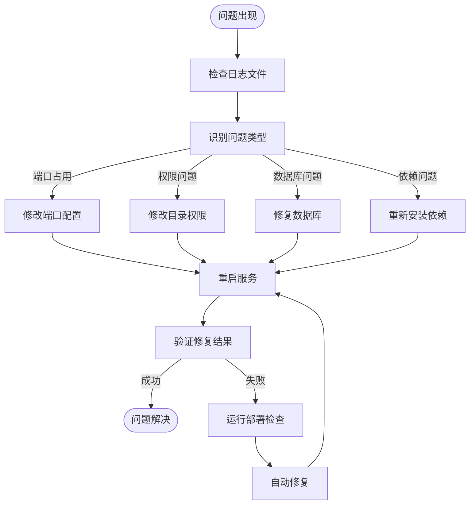

# 部署指南

<cite>
**本文档引用的文件**   
- [start-simple-server.js](file://start-simple-server.js)
- [check-deployment.js](file://backend/scripts/check-deployment.js)
- [init-db.js](file://backend/init-db.js)
- [package.json](file://backend/package.json)
- [.env](file://backend/.env)
- [app-simple.js](file://backend/src/app-simple.js)
</cite>

## 目录
1. [简介](#简介)
2. [项目结构](#项目结构)
3. [核心组件](#核心组件)
4. [架构概述](#架构概述)
5. [详细组件分析](#详细组件分析)
6. [依赖分析](#依赖分析)
7. [性能考虑](#性能考虑)
8. [故障排除指南](#故障排除指南)
9. [结论](#结论)

## 简介
兵智世界是一个基于知识图谱的现代化军事武器信息管理与可视化系统，集成了武器信息管理、知识图谱可视化、多媒体展示等功能。本部署操作手册详细说明了如何在开发环境、生产环境和Docker容器化三种场景下部署该系统，涵盖了PM2进程管理、Nginx反向代理配置和跨平台（Windows/Linux/macOS）部署的完整步骤。

**Section sources**
- [README.md](file://README.md#L1-L522)

## 项目结构
兵智世界项目采用前后端分离架构，后端服务位于`backend`目录，前端页面和脚本分布在根目录。系统使用Node.js + Express.js作为后端框架，SQLite作为轻量级数据库，提供API服务和静态文件服务。

**Diagram sources **
- [README.md](file://README.md#L1-L522)

**Section sources**
- [README.md](file://README.md#L1-L522)

## 核心组件
系统的核心组件包括简化版后端服务器、部署检查脚本、数据库初始化脚本和环境配置文件。通过`start-simple-server.js`启动服务，使用`check-deployment.js`脚本验证部署状态并自动修复问题。

**Section sources**
- [start-simple-server.js](file://start-simple-server.js#L1-L78)
- [check-deployment.js](file://backend/scripts/check-deployment.js#L1-L260)
- [init-db.js](file://backend/init-db.js#L1-L45)

## 架构概述
兵智世界采用简化版架构，基于Node.js + SQLite实现，无需安装复杂数据库，适合快速开发和测试。系统提供用户认证、武器数据管理、知识图谱可视化等核心功能。

**Diagram sources **
- [README-SIMPLE.md](file://backend/README-SIMPLE.md#L1-L268)

**Section sources**
- [README-SIMPLE.md](file://backend/README-SIMPLE.md#L1-L268)

## 详细组件分析

### 启动服务分析
`start-simple-server.js`脚本用于启动简化版后端服务器，使用SQLite数据库，适合开发和演示环境。

**Diagram sources **
- [start-simple-server.js](file://start-simple-server.js#L1-L78)

**Section sources**
- [start-simple-server.js](file://start-simple-server.js#L1-L78)

### 部署检查分析
`check-deployment.js`脚本用于验证部署状态并自动修复常见问题，确保系统稳定运行。

**Diagram sources **
- [check-deployment.js](file://backend/scripts/check-deployment.js#L1-L260)

**Section sources**
- [check-deployment.js](file://backend/scripts/check-deployment.js#L1-L260)

### 数据库初始化分析
`init-db.js`脚本用于初始化SQLite数据库，创建必要的数据表和索引。

**Diagram sources **
- [init-db.js](file://backend/init-db.js#L1-L45)

**Section sources**
- [init-db.js](file://backend/init-db.js#L1-L45)

## 依赖分析
系统依赖主要分为Node.js包依赖和运行时依赖。通过package.json文件管理Node.js包依赖，确保开发和生产环境的一致性。

**Diagram sources **
- [package.json](file://backend/package.json#L1-L44)

**Section sources**
- [package.json](file://backend/package.json#L1-L44)

## 性能考虑
系统在性能方面进行了多项优化，包括内存缓存、查询优化和数据预加载，确保在高并发场景下的稳定运行。

**Diagram sources **
- [README-SIMPLE.md](file://backend/README-SIMPLE.md#L1-L268)

## 故障排除指南
当系统部署或运行出现问题时，可以通过以下步骤进行故障排除和修复。

**Section sources**
- [check-deployment.js](file://backend/scripts/check-deployment.js#L1-L260)
- [README.md](file://README.md#L1-L522)

## 结论
兵智世界系统提供了完整的部署解决方案，支持开发环境、生产环境和Docker容器化三种部署场景。通过详细的部署操作手册，用户可以轻松搭建和维护系统，确保其稳定运行。建议在生产环境中使用PM2进行进程管理，并配置Nginx反向代理以提高系统性能和安全性。