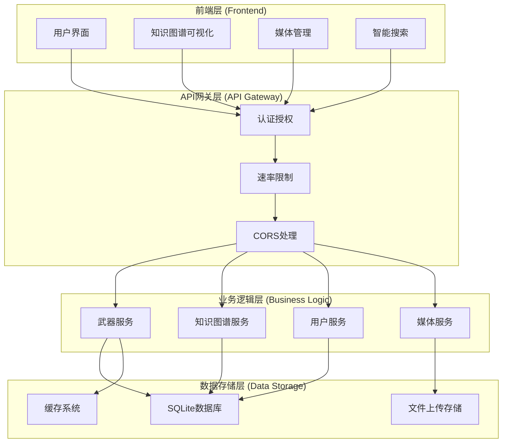
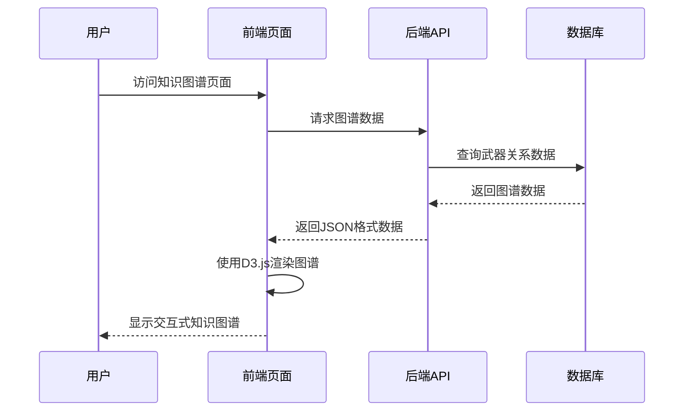
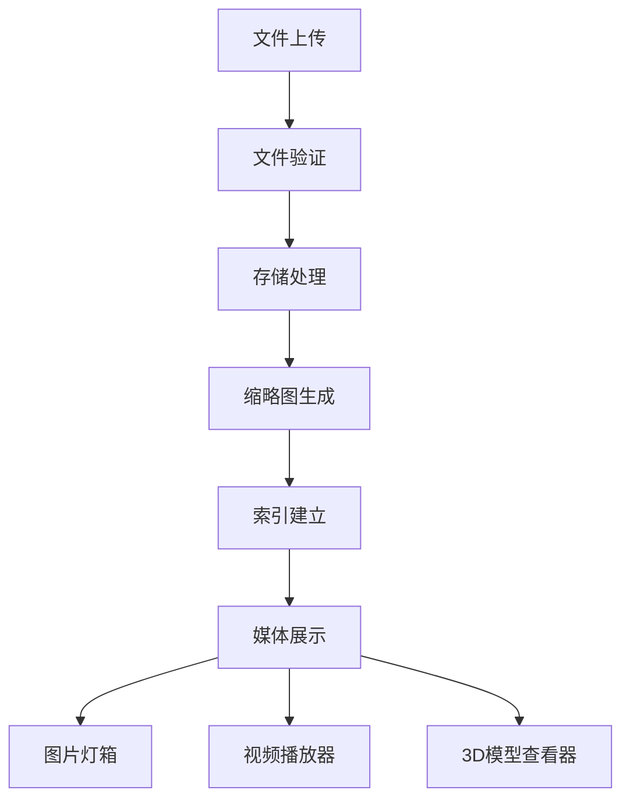
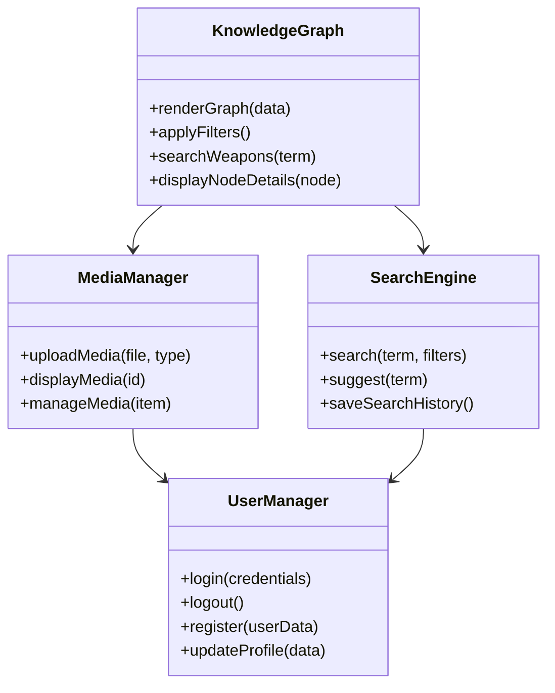
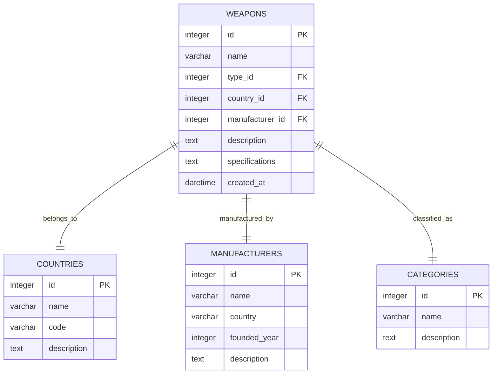
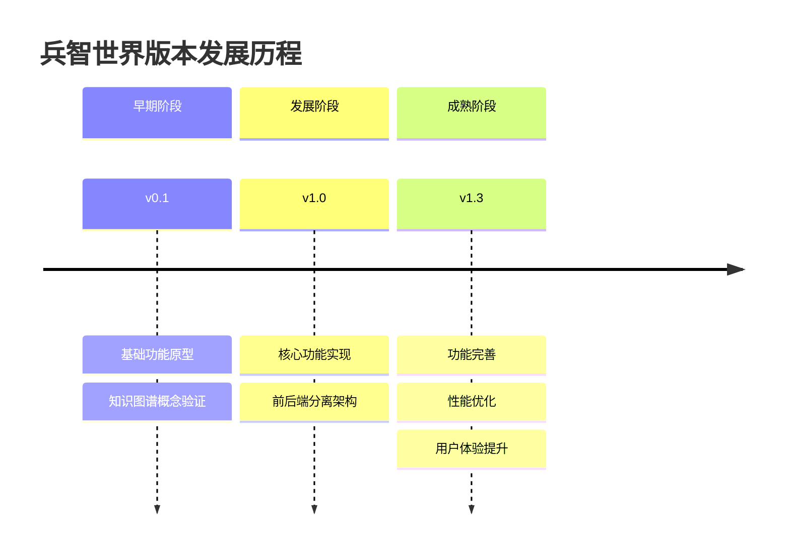

# 兵智世界v1.3项目概述

<cite>
**本文档引用的文件**
- [README.md](file://README.md)
- [index.html](file://index.html)
- [knowledge-graph.html](file://knowledge-graph.html)
- [package.json](file://package.json)
- [backend/package.json](file://backend/package.json)
- [backend/src/app-simple.js](file://backend/src/app-simple.js)
- [backend/api.py](file://backend/api.py)
- [knowledge-graph.js](file://knowledge-graph.js)
- [scripts/knowledge-graph.js](file://scripts/knowledge-graph.js)
- [backend/src/routes/knowledge-graph.js](file://backend/src/routes/knowledge-graph.js)
- [backend/src/services/knowledgeGraphService.js](file://backend/src/services/knowledgeGraphService.js)
</cite>

## 目录
1. [项目简介](#项目简介)
2. [核心价值与定位](#核心价值与定位)
3. [系统架构](#系统架构)
4. [主要功能模块](#主要功能模块)
5. [技术栈与实现](#技术栈与实现)
6. [项目命名与版本演进](#项目命名与版本演进)
7. [目标用户群体](#目标用户群体)
8. [扩展潜力与未来规划](#扩展潜力与未来规划)
9. [总结](#总结)

## 项目简介

兵智世界v1.3是一个基于知识图谱的现代化军事武器信息管理与可视化系统。该项目采用前后端分离架构，集成了武器信息管理、知识图谱可视化、多媒体展示等核心功能，为军事爱好者、研究人员和教育工作者提供了一个全面的军事武器知识平台。

### 项目特色
- **知识图谱可视化**：利用D3.js技术实现交互式武器关系网络展示
- **多媒体支持**：完整的图片、视频、3D模型管理功能
- **智能搜索**：支持全文搜索和高级筛选功能
- **数据完整性**：完善的武器分类、制造商和国家信息管理
- **用户友好**：现代化UI设计，操作简单直观

**章节来源**
- [README.md](file://README.md#L1-L50)

## 核心价值与定位

### 系统核心定位
兵智世界定位于成为军事武器领域的知识图谱平台，通过构建复杂的武器关系网络，为用户提供深入的军事知识理解和分析能力。

### 核心价值体现

#### 1. 知识图谱可视化价值
- **直观展示武器关系**：通过交互式图谱清晰展现武器、制造商、国家、类型之间的复杂关系
- **多维分析能力**：支持按不同维度进行数据筛选和分析
- **实时交互体验**：动态图谱展示和节点详情查看功能

#### 2. 多媒体内容价值
- **全方位展示**：通过图片、视频、3D模型等多种形式展示武器特征
- **内容管理**：完善的媒体文件上传、管理和展示机制
- **用户体验**：支持图片灯箱和视频播放器等现代化功能

#### 3. 智能搜索价值
- **快速定位**：支持武器名称、描述、规格的全文搜索
- **高级筛选**：多条件组合筛选和智能搜索建议
- **结果排序**：按相关度、时间等多种方式排序

#### 4. 数据管理价值
- **数据完整性**：完善的武器分类和制造商信息
- **批量操作**：支持数据批量导入导出
- **数据质量**：数据清洗和完整性检查机制

**章节来源**
- [README.md](file://README.md#L15-L35)

## 系统架构

### 整体架构设计



**图表来源**
- [backend/src/app-simple.js](file://backend/src/app-simple.js#L1-L50)
- [backend/package.json](file://backend/package.json#L1-L20)

### 前后端分离架构

#### 前端架构特点
- **原生JavaScript开发**：不依赖第三方框架，保持轻量化
- **D3.js数据可视化**：专业的数据可视化解决方案
- **响应式设计**：适配移动端和桌面端设备
- **模块化组织**：功能模块独立，便于维护和扩展

#### 后端架构特点
- **Node.js + Express**：高性能的服务器端框架
- **RESTful API设计**：标准化的接口规范
- **中间件系统**：安全、限流、日志等中间件
- **数据库抽象**：支持多种数据库后端

**章节来源**
- [backend/src/app-simple.js](file://backend/src/app-simple.js#L15-L80)
- [README.md](file://README.md#L100-L150)

## 主要功能模块

### 1. 知识图谱可视化模块

#### 核心功能
- **交互式图谱展示**：基于D3.js的动态知识图谱
- **多维关系网络**：武器-制造商-国家-类型多层关系
- **实时筛选功能**：按制造商、武器类型、国家等维度筛选
- **节点详情展示**：点击节点查看详细武器信息
- **图谱分析功能**：统计分析和数据洞察

#### 技术实现


**图表来源**
- [knowledge-graph.js](file://knowledge-graph.js#L1-L100)
- [backend/src/routes/knowledge-graph.js](file://backend/src/routes/knowledge-graph.js#L1-L50)

### 2. 武器信息管理模块

#### 功能特性
- **武器数据录入**：完整的武器规格和性能参数
- **分类管理体系**：武器类型、国家分类管理
- **制造商信息管理**：制造商信息和统计数据
- **批量数据操作**：支持数据批量导入导出

#### 数据模型
| 表名 | 字段 | 类型 | 描述 |
|------|------|------|------|
| weapons | id | INTEGER | 武器唯一标识符 |
| weapons | name | VARCHAR(255) | 武器名称 |
| weapons | type_id | INTEGER | 武器类型ID |
| weapons | country_id | INTEGER | 国家ID |
| weapons | manufacturer_id | INTEGER | 制造商ID |
| weapons | description | TEXT | 武器描述 |
| weapons | specifications | TEXT | 技术规格 |

**章节来源**
- [backend/src/routes/knowledge-graph.js](file://backend/src/routes/knowledge-graph.js#L10-L80)

### 3. 多媒体管理模块

#### 功能组成
- **图片管理系统**：武器图片上传、展示、管理
- **视频管理系统**：武器视频上传、播放、管理
- **3D模型管理**：武器3D模型展示和管理
- **媒体预览功能**：支持图片灯箱和视频播放器

#### 技术架构


**图表来源**
- [scripts/knowledge-graph.js](file://scripts/knowledge-graph.js#L400-L600)

### 4. 智能搜索模块

#### 搜索功能
- **全文搜索**：支持武器名称、描述、规格搜索
- **高级筛选**：多条件组合筛选
- **搜索建议**：智能搜索提示和自动补全
- **结果排序**：按相关度、时间等多种方式排序

#### 搜索算法
- **文本匹配**：基于关键词的文本匹配算法
- **模糊搜索**：支持拼写错误和近似匹配
- **权重计算**：基于字段重要性的搜索结果排序

**章节来源**
- [scripts/knowledge-graph.js](file://scripts/knowledge-graph.js#L700-L799)

### 5. 用户系统模块

#### 权限管理
- **用户认证**：登录注册功能
- **角色控制**：管理员和普通用户权限分离
- **操作日志**：完整的用户操作记录

#### 安全特性
- **JWT令牌认证**：安全的用户身份验证
- **权限验证**：基于角色的访问控制
- **数据加密**：敏感数据加密存储

**章节来源**
- [backend/src/app-simple.js](file://backend/src/app-simple.js#L100-L150)

## 技术栈与实现

### 前端技术栈

#### 核心技术
- **HTML5/CSS3**：现代化网页标准
- **JavaScript ES6+**：原生JavaScript开发
- **D3.js**：数据可视化和图谱渲染
- **Chart.js**：统计图表展示
- **Lightbox**：图片灯箱效果
- **Swiper**：图片轮播组件

#### 前端架构


**图表来源**
- [knowledge-graph.js](file://knowledge-graph.js#L50-L150)
- [scripts/knowledge-graph.js](file://scripts/knowledge-graph.js#L1-L100)

### 后端技术栈

#### 核心框架
- **Node.js**：服务器运行环境
- **Express.js**：Web应用框架
- **SQLite**：轻量级数据库
- **Multer**：文件上传处理
- **Better-SQLite3**：高性能SQLite驱动

#### 安全与性能
- **CORS**：跨域资源共享
- **Helmet**：安全中间件
- **Rate Limiting**：API限流
- **Compression**：响应压缩

#### 数据库设计


**图表来源**
- [backend/src/routes/knowledge-graph.js](file://backend/src/routes/knowledge-graph.js#L150-L250)

### API设计规范

#### RESTful API结构
- **基础URL**: `http://localhost:3001/api`
- **认证方式**: Header `x-admin-user: admin`
- **数据格式**: JSON
- **字符编码**: UTF-8

#### 核心API端点
| 端点 | 方法 | 描述 |
|------|------|------|
| `/api/weapons` | GET | 获取武器列表 |
| `/api/weapons/:id` | PUT | 更新武器信息 |
| `/api/weapons/:id` | DELETE | 删除武器 |
| `/api/knowledge/graph-data` | GET | 获取知识图谱数据 |
| `/api/weapon-images/:id/upload` | POST | 上传武器图片 |
| `/api/weapon-videos/:id/upload` | POST | 上传武器视频 |

**章节来源**
- [README.md](file://README.md#L200-L300)

## 项目命名与版本演进

### 项目命名由来

"兵智世界"这一名称蕴含深刻含义：

#### 名称寓意
- **兵**：代表军事、武器装备
- **智**：象征智慧、智能化
- **世界**：体现全球化视野和全面覆盖

#### 设计理念
- **知识传承**：将军事知识智慧传递给用户
- **全球视野**：涵盖世界各国的武器装备
- **智能化展示**：利用现代技术呈现军事知识

### 版本演进线索

#### v1.3版本特性
- **稳定版本**：经过充分测试的成熟版本
- **功能完整**：核心功能均已实现
- **性能优化**：针对性能进行了优化改进
- **用户体验**：界面和交互体验得到提升

#### 版本发展轨迹


### 未来版本规划

#### v1.4版本展望
- **移动端App开发**：开发专用移动应用程序
- **实时协作功能**：支持多人协同编辑
- **高级数据分析**：更深入的数据分析功能
- **机器学习推荐**：基于AI的智能推荐系统

#### 长期发展规划
- **3D武器模型展示**：支持更真实的武器展示
- **VR/AR技术支持**：虚拟现实和增强现实功能
- **多语言国际化**：支持多种语言版本
- **云端部署方案**：提供云服务部署选项

**章节来源**
- [README.md](file://README.md#L450-L520)

## 目标用户群体

### 军事爱好者
- **需求特点**：对军事武器有浓厚兴趣
- **使用场景**：了解武器性能、历史背景
- **功能需求**：详细的武器信息、图片展示、历史资料

### 军事研究人员
- **需求特点**：需要准确、全面的军事数据
- **使用场景**：学术研究、论文写作、数据分析
- **功能需求**：精确的数据查询、统计分析、数据导出

### 教育工作者
- **需求特点**：需要教学素材和参考资料
- **使用场景**：军事课程教学、国防教育
- **功能需求**：易于使用的界面、丰富的多媒体内容

### 军事院校学生
- **需求特点**：学习军事知识、准备考试
- **使用场景**：课堂学习、课后复习
- **功能需求**：系统化的知识体系、互动式学习

### 军事分析师
- **需求特点**：进行军事形势分析
- **使用场景**：情报分析、战略研究
- **功能需求**：深度数据分析、趋势预测

### 系统架构用户画像
```mermaid
mindmap
root((兵智世界用户群体))
军事爱好者
兴趣驱动
探索学习
社交分享
研究人员
学术需求
数据准确性
分析工具
教育工作者
教学需求
素材丰富
易用性
学生群体
学习需求
系统化知识
互动体验
分析师
数据分析
战略研究
趋势预测
```

**章节来源**
- [README.md](file://README.md#L50-L100)

## 扩展潜力与未来规划

### 技术扩展方向

#### 1. AI智能功能
- **武器识别**：基于图像识别的武器自动识别
- **智能问答**：自然语言处理的军事知识问答
- **推荐系统**：基于用户兴趣的个性化推荐
- **数据分析**：机器学习驱动的趋势分析

#### 2. 多媒体技术
- **3D模型展示**：更逼真的武器3D模型展示
- **VR/AR体验**：虚拟现实和增强现实体验
- **视频分析**：视频内容的智能分析和标注
- **音频解说**：武器介绍的语音解说功能

#### 3. 数据集成
- **外部数据源**：整合其他军事数据库
- **实时数据**：接入实时军事新闻和动态
- **API开放**：为第三方开发者提供API接口
- **数据共享**：与其他军事知识平台的数据共享

### 商业化潜力

#### 1. 企业级应用
- **军队训练**：军事院校和部队训练系统
- **国防教育**：政府机构的国防教育平台
- **军事出版**：军事图书和杂志的内容平台
- **教育培训**：军事培训机构的在线平台

#### 2. 内容变现
- **付费内容**：深度军事分析报告
- **会员服务**：高级功能订阅
- **广告合作**：军事相关产品推广
- **数据服务**：军事数据API收费

### 社区建设

#### 1. 用户社区
- **专家入驻**：邀请军事专家入驻平台
- **用户贡献**：鼓励用户贡献军事知识
- **讨论论坛**：建立军事话题讨论社区
- **活动组织**：定期举办军事知识竞赛

#### 2. 生态合作
- **军事机构**：与军事研究机构合作
- **教育机构**：与军事院校建立合作关系
- **科技公司**：与科技企业进行技术合作
- **内容平台**：与军事媒体平台合作

**章节来源**
- [README.md](file://README.md#L450-L520)

## 总结

兵智世界v1.3作为一个基于知识图谱的军事武器信息管理与可视化系统，在以下几个方面展现了其独特的价值和潜力：

### 核心优势
1. **技术创新**：采用知识图谱技术实现复杂的武器关系可视化
2. **功能完整**：涵盖了武器信息管理、多媒体展示、智能搜索等核心功能
3. **用户体验**：现代化的界面设计和直观的操作体验
4. **技术先进**：前后端分离架构，采用主流技术栈

### 应用价值
- **教育价值**：为军事教育和学习提供了优质的平台资源
- **研究价值**：为军事研究人员提供了可靠的数据支撑
- **科普价值**：为广大军事爱好者提供了丰富的知识内容
- **实用价值**：满足了不同用户群体的实际需求

### 发展前景
兵智世界项目具有广阔的发展空间，通过持续的技术创新和功能完善，有望成为军事知识领域的重要平台。项目的模块化设计和标准化接口为未来的扩展奠定了良好的基础，而明确的版本规划和技术路线图则为项目的可持续发展提供了保障。

对于初学者而言，兵智世界提供了一个学习知识图谱技术和军事知识的良好起点；对于高级用户和专业研究人员，它则是一个功能强大、扩展性强的专业平台。随着项目的不断发展和完善，相信兵智世界将在军事知识传播和研究领域发挥越来越重要的作用。